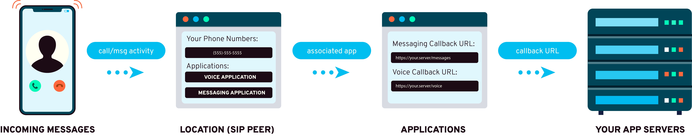


<section class="applicationsConfigurationGuide">


# Applications

Bandwidth uses HTTP Callbacks (also known as [webhooks](../../guides/callbacks/callbacks.md)) to send [message events](../../messaging/callbacks/messageEvents.md) & [voice events](../../voice/bxml/callbacks/about.md) to any publicly addressable url.

In order to successfully use the Voice & Messaging APIs, you need to configure an `Application` for **both** the [Voice API](../../voice/about.md) & the [Messaging API](../../messaging/about.md).

Applications contain the `MsgCallbackUrl` for messaging applications or the `CallInitiatedCallbackUrl` & `CallStatusCallbackUrl` for voice applications.  These URLs are used to send either [message events](../../messaging/callbacks/messageEvents.md) or [voice events](../../voice/bxml/callbacks/about.md) to your service.
The application object also contains the `CallbackCreds` to authenticate requests to your server.

Each application can be assigned to as many `Locations` as needed.  However, each `Location` can only have a single `Application` per service type.

### Base Url

`https://dashboard.bandwidth.com/api/accounts/{{accountId}}/applications`

### Capabilities

| Verb                               | Path                                                                                                                   | about                                                               |
|:-----------------------------------|:-----------------------------------------------------------------------------------------------------------------------|:--------------------------------------------------------------------|
| <code class="get">GET</code>       | [`/api/accounts/{accountId}/applications`](methods/getApplications.md)                                                         | List all Applications                                               |
| <code class="post">POST</code>     | [`/api/accounts/{accountId}/applications`](methods/postApplications.md)                                                        | Create an application                                               |
| <code class="get">GET</code>       | [`/api/accounts/{accountId}/applications/{applicationId}`](methods/getApplicationsApplicationId.md)                            | Get information about a specific application                        |
| <code class="patch">PATCH</code>   | [`/api/accounts/{accountId}/applications/{applicationId}`](methods/patchApplicationsApplicationId.md)                          | Patch changes to an application                                     |
| <code class="put">PUT</code>       | [`/api/accounts/{accountId}/applications/{applicationId}`](methods/putApplicationsApplicationId.md)                            | Make changes to an application                                      |
| <code class="delete">DELETE</code> | [`/api/accounts/{accountId}/applications/{applicationId}`](methods/deleteApplicationsApplicationId.md)                         | Delete an application                                               |
| <code class="get">GET</code>       | [`/api/accounts/{accountId}/applications/{applicationId}/associatedsippeers`](methods/getApplicationsApplicationIdSippeers.md) | Retrieve a list of sippeers (location), associated with application |
