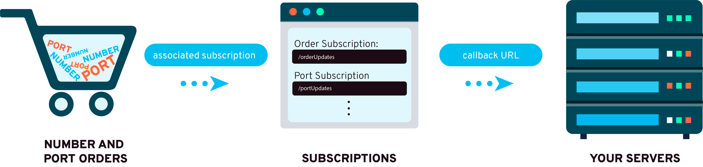

# Subscriptions

Bandwidth uses HTTP Callbacks (also known as [webhooks](../../guides/callbacks/callbacks.md)) to send [number ordering & porting events](../../numbers/callbacks/about.md) to any publicly addressable url.

In order to successfully use the Number Ordering & Porting APIs you need to configure an `subscription` for each `orderType` (in table below). Each subscription is account global and each **account** can have multiple subscriptions per `orderType`.

Subscriptions contain the `URL` & `CallbackCreds` to authenticate and send [number ordering & porting events](../../numbers/callbacks/about.md) for each state change.

### Base Url

`https://dashboard.bandwidth.com/api/accounts/{{accountId}}/subscriptions`

### Capabilities

| Verb                               | Path                                                                                                       | about                                         |
|:-----------------------------------|:-----------------------------------------------------------------------------------------------------------|:----------------------------------------------|
| <code class="get">GET</code>       | [`/api/accounts/{accountId}/subscriptions`](methods/getSubscriptions.md)                                   | List all subscriptions                        |
| <code class="post">POST</code>     | [`/api/accounts/{accountId}/subscriptions`](methods/postSubscriptions.md)                                  | Create an subscription                        |
| <code class="get">GET</code>       | [`/api/accounts/{accountId}/subscriptions/{subscriptionId}`](methods/getSubscriptionsSubscriptionId.md)    | Get information about a specific subscription |
| <code class="put">PUT</code>       | [`/api/accounts/{accountId}/subscriptions/{subscriptionId}`](methods/putSubscriptionsSubscriptionId.md)    | Make changes to an subscription               |
| <code class="delete">DELETE</code> | [`/api/accounts/{accountId}/subscriptions/{subscriptionId}`](methods/deleteSubscriptionsSubscriptionId.md) | Delete an subscription                        |

### Order Types

| Order type       | Notified states                                                                                                     |
|:-----------------|:--------------------------------------------------------------------------------------------------------------------|
| `portins`        | `PENDING_DOCUMENTS`, `SUBMITTED`, `FOC`, `REQUESTED_SUPP`, `COMPLETE`, `CANCELLED`, `EXCEPTION`, `REQUESTED_CANCEL` |
| `orders`         | `COMPLETE`, `PARTIAL`, `BACKORDERED`, `FAILED`                                                                      |
| `portouts`       | `COMPLETE`                                                                                                          |
| `disconnects`    | `COMPLETE`, `PARTIAL`, `FAILED`                                                                                     |
| `dldas`          | `RECEIVED`, `PROCESSING`, `COMPLETE`, `PARTIAL`, `FAILED`                                                           |
| `lsrorders`      | `PENDING`, `FOC`, `EXCEPTION`, `COMPLETE`, `CANCELLED`, `PARTIAL`, `FAILED`                                         |
| `e911s`          | `RECEIVED`, `PROCESSING`, `COMPLETE`, `ADJUSTED_COMPLETE`, `PARTIAL`, `ADJUSTED_PARTIAL`, `FAILED`                  |
| `tnoptions`      | `RECEIVED`, `PROCESSING`, `COMPLETE`, `PARTIAL`, `FAILED`                                                           |
| `externalTns`    | `COMPLETE`, `PARTIAL`, `FAILED`                                                                                     |
| `importtnorders` | `COMPLETE`, `PARTIAL`, `FAILED`, `EXCEPTION`                                                                        |
| `lidb`           | `PROCESSING`, `COMPLETE`, `PARTIAL`, `FAILED`                                                                       |
| `bulkPortins`    | `DRAFT`, `IN_PROGRESS`, `NEEDS_ATTENTION`, `PARTIAL`, `COMPLETED`, `CANCELLED`                                      |