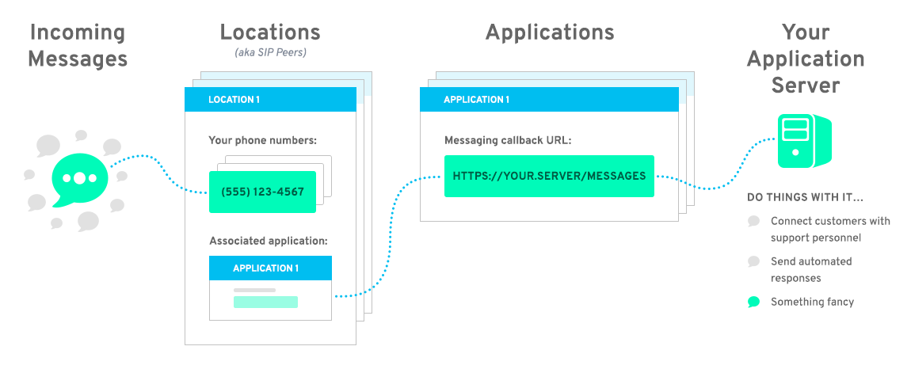

# Applications

Bandwidth uses HTTP Callbacks (also known as [webhooks](https://webhooks.pbworks.com/w/page/13385124/FrontPage)) to send [message events](../events/messageEvents.md) to any publicly addressable url.

In order to successfully use the Messaging 2.0 APIs, you need to configure an `Application` which contains the `CallbackUrl`.  Each application can be assigned to as many `Locations` as needed.  However, each `Location` can only have a single `Application`

### Base Url
`https://dashboard.bandwidth.com/api/accounts/{{accountId}}/applications`

### Capabilities

| Verb                               | Path                                                                                                                       | about                                                               |
|:-----------------------------------|:---------------------------------------------------------------------------------------------------------------------------|:--------------------------------------------------------------------|
| <code class="get">GET</code>       | [`/api/accounts/{accountId}/applications`](getApplications.md)                                                           | List all Applications                                               |
| <code class="post">POST</code>     | [`/api/accounts/{accountId}/applications`](postApplications.md)                                                          | Create an application                                               |
| <code class="get">GET</code>       | [`/api/accounts/{accountId}/applications/{applicationId}`](getApplicationsApplicationId.md)                            | Get information about a specific application                        |
| <code class="patch">PATCH</code>    | [`/api/accounts/{accountId}/applications/{applicationId}`](patchApplicationsApplicationId.md)                          | Patch changes to an application                                     |
| <code class="put">PUT</code>      | [`/api/accounts/{accountId}/applications/{applicationId}`](putApplicationsApplicationId.md)                            | Make changes to an application                                      |
| <code class="delete">DELETE</code> | [`/api/accounts/{accountId}/applications/{applicationId}`](deleteApplicationsApplicationId.md)                          | Delete an application                                               |
| <code class="get">GET</code>       | [`/api/accounts/{accountId}/applications/{applicationId}/associatedsippeers`](getApplicationsApplicationIdSippeers.md) | Retrieve a list of sippeers (location), associated with application |