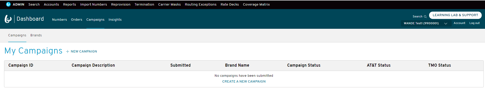
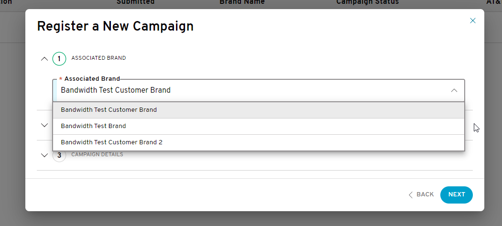
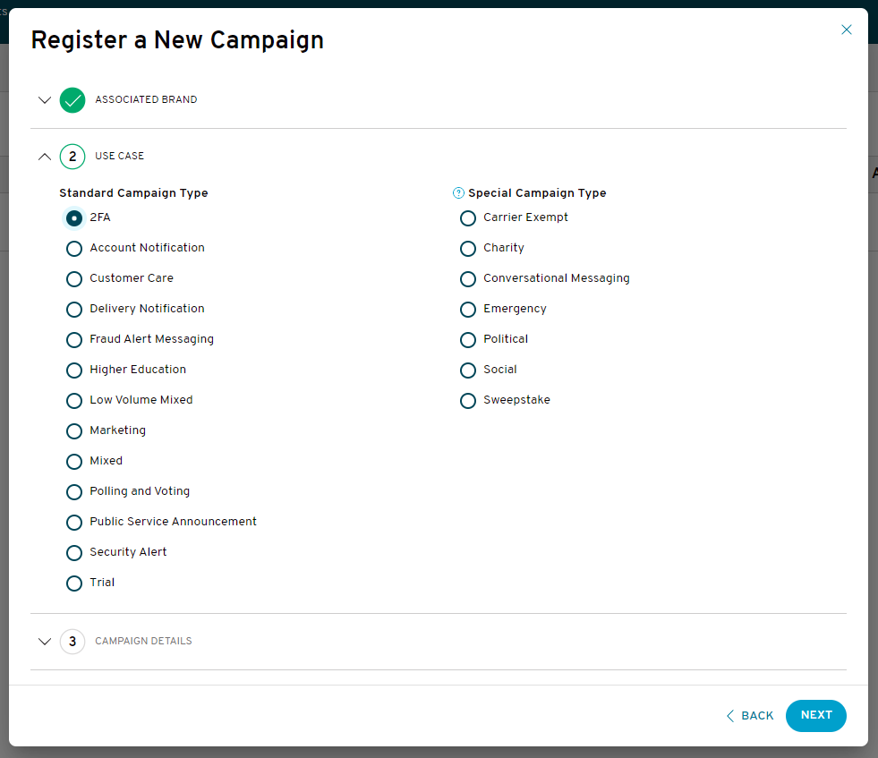
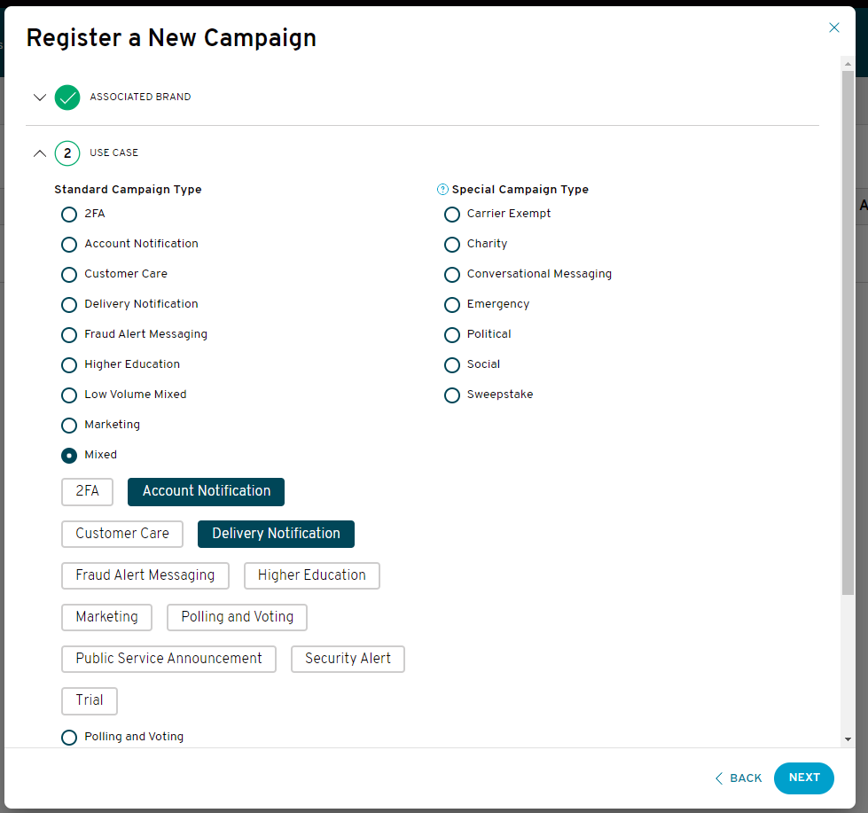
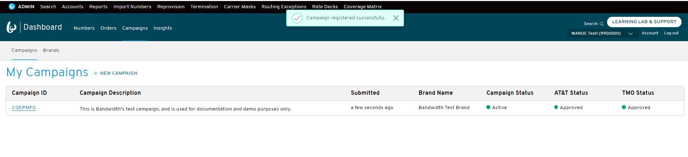
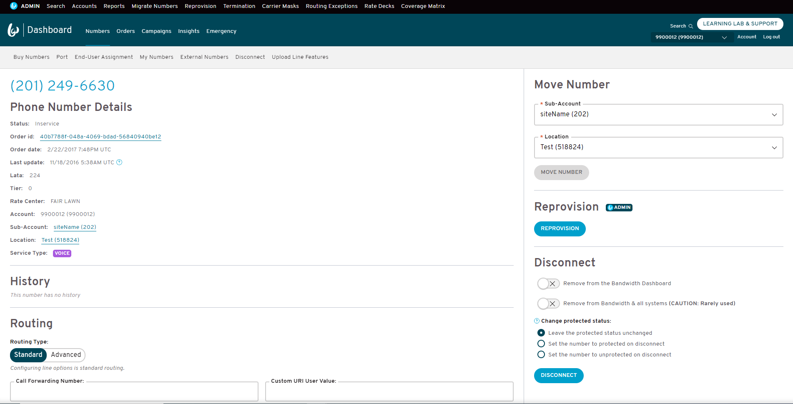
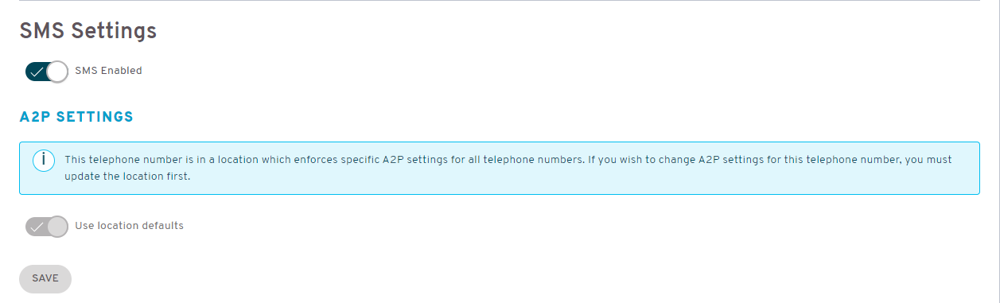
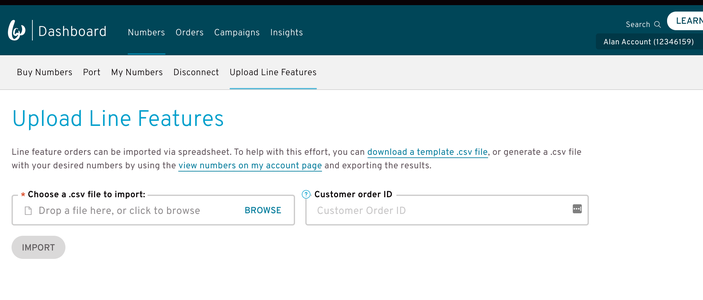
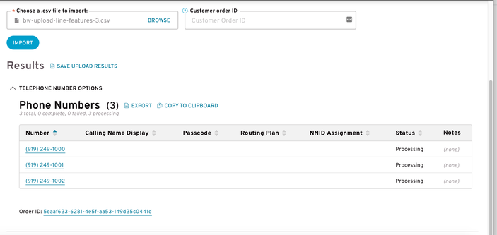


<section class="campaignManagementCspGuides">


# Bandwidth 10DLC CSP Campaigns UI Guide {#top}

This walks through how to provision, manage and view your campaigns through the [Bandwidth Dashboard](https://dashboard.bandwidth.com) for use with our [Campaign](../about.md), [Number Management](../../../numbers/about.md) and [Messaging](../../../messaging/about.md) API's.

## Assumptions
* You have been contracted and given access to your Bandwidth Dashboard Account
* Your account has Messaging and Campaign Management products enabled
* Your account has 10dlcCampaigns product feature enabled
* Your user has been assigned the Campaign Management user role
* You have registered your [brand(s)](bandwidth10dlcBrandCspUiGuide.md)

## Steps
1. [Register a campaign](#register-a-campaign)
    * [Standard use case](#standard-use-case)
    * [Mixed use case](#mixed-use-case)
    * [Special use case](#special-use-case)
2. [Campaign List](#campaign-list)
    *. [Campaign Statuses](#campaign-statuses)
        * [Campaign Status](#campaign-status)
        * [MNO Status](#mno-status)
4. [View campaign details](#view-campaign-details)
5. [Edit campaign](#edit-campaign)
6. [Deactivate campaign](#deactivate-campaign)
7. [Assign a campaign to a TN](#assign-a-campaign-to-a-tn)
8. [Bulk assign a campaign to multiple TNs](#bulk-assign-a-campaign-to-multiple-tns)
9. [Next steps](#next-steps)
    * [Create an API-only user](#create-an-api-only-user)
    * [Start developing to our Messaging APIs](#start-developing-to-our-messaging-apis)

## Register a campaign
Once you log into the Bandwidth Dashboard, you should see **Campaigns** in the navigation bar. 
If you select it, you will be routed to the **Brands** sub navigation. From there you can select the **Campaigns** sub navigation
which is where you will see a list of the campaigns that have been previously registered on your account. 

 

The first section is where you will select the brand you want to associate with the campaign. 

 

The second section is where you will select the campaign use case(s). 

### Standard use case
For standard use cases, you only need to select one to proceed to the next section. 
 
### Mixed use case
For mixed use cases (Mixed or Low Volume Mixed), once selected, you will see sub-use cases display below. You must select two or more to continue to the next section. 
 
### Special use case
Special use cases are on the right side of the form. These use cases need to go through MNO manual approval processes and may not be approved for some time after registering. 

The third and final section is where you will enter the campaign details. 

## Campaign List
Once you successfully register a campaign, you will be navigated back to the campaign list page 

 

## Campaign Statuses
While on the imported campaign list page, you have the option to select the '+ NEW IMPORTED CAMPAIGN' button.
This will display a popup modal which allows you to enter the ID of the campaign you want to import. 

 

### Campaign Status
### MNO Status

## View Campaign Details
While on the imported campaign list page, you have the option to select the '+ NEW IMPORTED CAMPAIGN' button.
This will display a popup modal which allows you to enter the ID of the campaign you want to import. 

 

## Edit Campaign
While on the imported campaign list page, you have the option to select the '+ NEW IMPORTED CAMPAIGN' button.
This will display a popup modal which allows you to enter the ID of the campaign you want to import. 

 

## Deactivate Campaign
While on the imported campaign list page, you have the option to select the '+ NEW IMPORTED CAMPAIGN' button.
This will display a popup modal which allows you to enter the ID of the campaign you want to import. 

 

## Assign a campaign to a TN

You should see **Numbers** in the navigation bar. 
If you select it, you will be routed to a sub navigation where you will see **My Numbers**.
If you select it, you can search for a TN and view the details page.

 

Once on the TN details page, you can scroll to the bottom where you will see SMS Settings. 
Ensure SMS Settings is on, and that use location defaults is off. 
You will see a dropdown labeled **A2P Campaign ID**. 
Your imported campaigns will be found in the dropdown. 
When you select a Campaign ID the **Message Class** field will auto-populate with the message class assigned from TCR.
When you click the **Save** button, the TN will be associated with the Campaign ID and will be ready for use. 

_Note_: 
If you don't see the Campaign ID in the dropdown, it's likely that - 
1) it has not been approved by all Mobile Network Operators (MNOs),
2) it has been deactivated or expired 
For a full list of status values and descriptions, please see [our campaign FAQs](campaignFaqs.md)  

  
  
 

_Note_: 
If you are not able to turn location defaults off, you will need to go to the location and disable the 'Enforce Location Long Code Settings for all numbers' setting -  
 

 

For more info on TNs, please see [our number ordering guide](../../../numbers/guides/onDemandNumberSearchAndOrder.md)

## Bulk Assign a campaign to multiple TNs
You should see **Numbers** in the navigation bar. 
If you select it, you will be routed to a sub navigation where you will see **Upload Line Features**.
If you select it, you will see the **Choose a .csv file to import** field.

 

A sample CSV is as follows -

| TN                | CampaignId        | Action            |
|:------------------|:------------------|:------------------|
| `9192491000`      | `CABCDEF`         | `asSpecified`     |
| `9192491001`      | `CEFGHIJ`         | `asSpecified`     |
| `9192491002`      | `C0123456`        | `asSpecified`     |

Once you click the **Import** button the TNs will be processed. 
Upon successful completion, the TNs will have the appropriate Campaign ID assigned and will be ready for use.

 

For more info on TNs, please see [Managing Line Features](../../../numbers/guides/managingLineFeatures.md)

## Next steps
### Create an API-only user
Create an [API-only user](../../../guides/accountCredentials.md) to validate your API calls. Unlike user accounts that can access the Bandwidth Dashboard User Interface, users restricted to API only access won’t require periodic password resets.

### Start developing to our Messaging APIs
After you've finished importing your campaigns, explore our inventory and order a phone number to your account. Once you have a phone number, you are ready to [send your first text message](../../../messaging/methods/messages/createMessage.md). For help, check out our [SDK’s and Postman Collection](../../../sdks/about.md).
