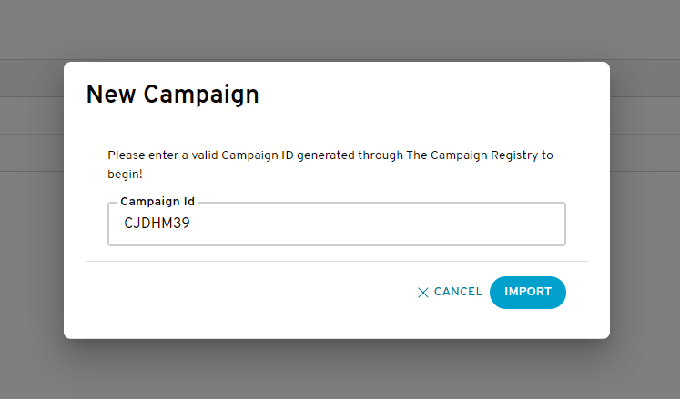


<section class="campaignManagementGuides">


# Bandwidth 10DLC Campaigns Import UI Guide {#top}

This walks through how to import and view your campaigns through the [Bandwidth Dashboard](dashboard.bandwidth.com) for use with our [Number Management](../../numbers/about.md) and [Messaging](../../messaging/about.md) API's.

## Assumptions
* You have been contracted and given access to your Bandwidth Dashboard Account
* Your account has Messaging and Campaign Management products enabled
* Your account has 10dlcImportCampaigns product feature enabled
* Your account has your CSP ID associated to it
* You have provisioned campaigns with The Campaign Registry (TCR) through your Campaign Service Provider (CSP)

## Steps
1. [View imported campaigns](#view-imported-campaigns)
1. [Import a campaign](#import-a-campaign)
1. [Assign a campaign to a TN](#assign-a-campaign-to-a-tn)
1. [Next steps](#next-steps)
    * [Create an API-only user](#create-an-api-only-user)
    * [Start developing to our Messaging APIs](#start-developing-to-our-messaging-apis)

## View imported campaigns

Once you log into the Bandwidth Dashboard, you should see **Campaigns** in the navigation bar. 
If you select it, you will be routed to the **IMPORTED CAMPAIGNS** sub navigation 
which is where you will see a list of the campaigns that have been previously imported on your account. 

## Import a campaign

While on the imported campaign list page, you have the option to select the '+ NEW IMPORTED CAMPAIGN' button.
This will display a popup modal which allows you to enter the ID of the campaign you want to import.

_Note: If you get an error message while importing, it is likely that -
1) your CSP ID on your account is incorrect
2) the campaign has not yet been shared with BANDW DCA

##### Campaign import fields
| Field Name                     | Mandatory | Description                                                                                                                        |
|:-------------------------------|:---------:|:-----------------------------------------------------------------------------------------------------------------------------------|
| Campaign ID                    | Yes       | Unique Campaign ID provided by TCR                                                                                                       |

### Assign a campaign to a TN
Coming soon!

## Next steps
### Create an API-only user
Create an [API-only user](../../guides/accountCredentials.md) to validate your API calls. Unlike user accounts that can access the Bandwidth Dashboard User Interface, users restricted to API only access won’t require periodic password resets.

### Start developing to our Messaging APIs
After you've finished importing your campaigns, explore our inventory and order a phone number to your account. Once you have a phone number, you are ready to [send your first text message](../../messaging/methods/messages/createMessage.md). For help, check out our [SDK’s and Postman Collection](../../sdks/about.md).
