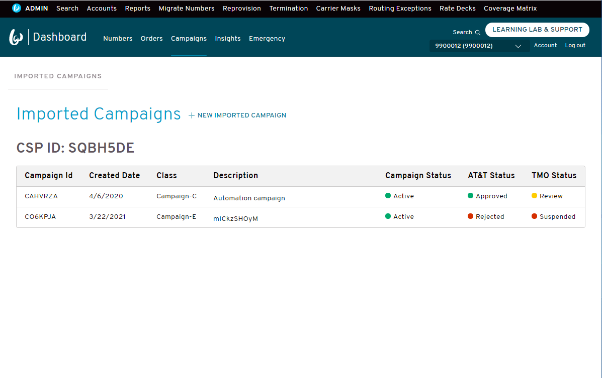
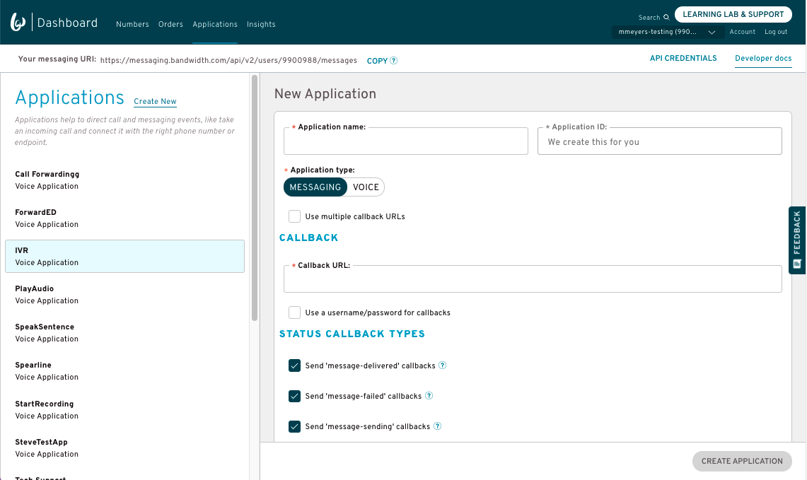
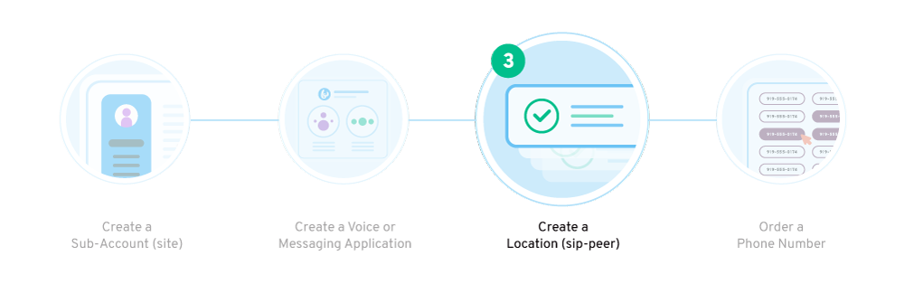
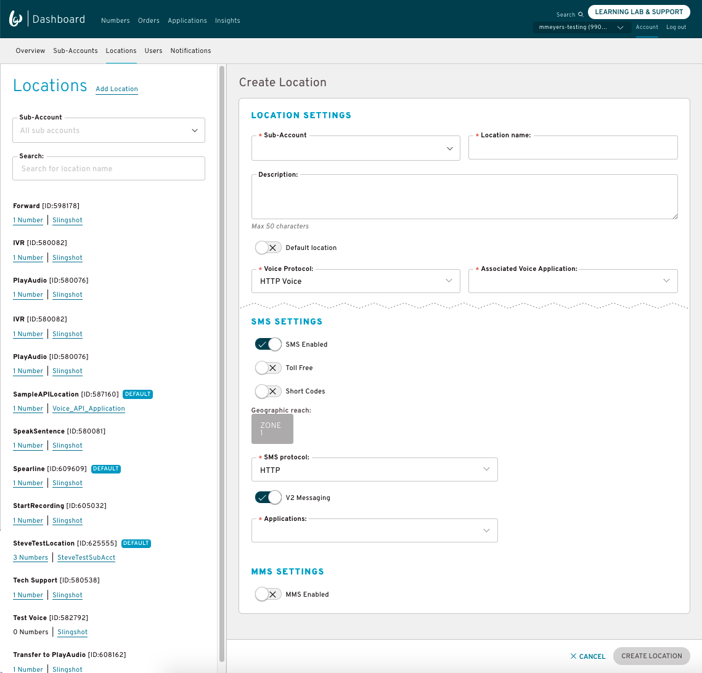


<section class="campaignManagementGuides">


# Bandwidth 10DLC Campaigns Import UI Guide {#top}

This walks through how to import, and view your campaigns through the [Bandwidth Dashboard](dashboard.bandwidth.com) for use with our [Number Management](../../numbers/about.md) and [HTTP Messaging](../../messaging/about.md) API's.

## Assumptions
* You have been contracted and given access to your Bandwidth Dashboard Account
* Your account has Messaging and Campaign Management products enabled
* Your account has 10dlcImportCampaigns product feature enabled
* Your account has your CSP ID associated to it
* You have provisioned campaigns with The Campaign Registry (TCR) through your Campaign Service Provider (CSP)

## Steps
1. [View imported campaigns](#view-imported-campaigns)
1. [Import a campaign](#import-a-campaign)
1. [Assign a campaign to a TN](#assign-a-campaign-to-a-tn)
1. [Next steps](#next-steps)
    * [Create an API-only user](#create-an-api-only-user)
    * [Start Developing to Our Voice and Messaging APIs](#start-developing-to-our-voice-and-messaging-apis)

## View imported campaigns

Once you log into the Bandwidth Dashboard, you should see **Campaigns** in the navigation bar. 
If you select it, you will be routed to the **IMPORTED CAMPAIGNS** sub navigation 
which is where you will see a list of the campaigns that have been previously imported on your account. 

## Import a campaign

While on the imported campaign list page, you have the option to select the '+ NEW IMPORTED CAMPAIGN' button.
This will display a popup modal which allows you to enter the ID of the campaign you want to import.

_Note: If you get an error message while importing, it is likely that -
1) your CSP ID on your account is incorrect
2) the campaign has not yet been shared with BANDW DCA

##### Campaign import fields
| Field Name                     | Mandatory | Description                                                                                                                        |
|:-------------------------------|:---------:|:-----------------------------------------------------------------------------------------------------------------------------------|
| Campaign ID                    | Yes       | Unique Campaign ID provided by TCR                                                                                                       |

### Assign a campaign to a TN
To begin using your Bandwidth Dashboard numbers for Messaging APIs, create a Messaging Application and then associate it with your phone number’s Location:

  1. In the top navigation bar, click **Applications**, and then click **Add Application**.
  1. Provide the Application name (we recommend you use something that identifies what the application will do).
  1. Under **Application type**, select **Messaging**.
  _Note: Once your application is created, you won’t be able to change the application type._
  1. Enter your callback URL(s)
  1. Select the types of callbacks you want to receive
  1. Click **Create Application**

##### Messaging Application Fields

| Field Name                         | Mandatory | Description                                                                                                      |
|:-----------------------------------|:---------:|:-----------------------------------------------------------------------------------------------------------------|
| Application Name                   | Yes       | Custom application name                                                                                          |
| Application ID                     | Yes       | Unique application ID needed for API calls - Bandwidth creates this for you                                      |
| Application Type                   | Yes       | VOICE or MESSAGING                                                                                               |
| Use Multiple Callback URLs         | No        | Optional toggle to allow you to split callbacks to different URLs for inbound and outbound messages              |
| (Inbound) Callback URL             | Yes       | URL to send inbound (or all) message callbacks to                                                                |
| Inbound Callback User ID           | No        | Optional user id bandwidth sends in the Authorization header of the callback                                     |
| Inbound Callback Password          | No        | Optional password bandwidth sends in the Authorization header of the callback                                    |
| Status Callback URL                | No        | URL to send status (outbound) message callbacks to                                                               |
| Status Callback User ID            | No        | Optional user id bandwidth sends in the Authorization header of the callback                                     |
| Status Callback Password           | No        | Optional password bandwidth sends in the Authorization header of the callback                                    |
| Send `message-delivered` Callbacks | No        | Optional toggle to turn on/off [`message-delivered`](../../messaging/callbacks/msgDelivered.md) callbacks events |
| Send `message-failed` Callbacks    | No        | Optional toggle to turn on/off [`message-failed`](../../messaging/callbacks/messageFailed.md) callbacks events   |
| Send `message-sending` Callbacks   | No        | Optional toggle to turn on/off [`message-sending`](../../messaging/callbacks/messageSending.md) callbacks events |

## Create a Location (SIP Peer)

A Location is where you’ll link your Application and provision other routing settings. When a phone number is added to a Location, it will inherit the settings and properties of that Location.

Link your Application with a Location:

  1. After you’ve created your Application, navigate to the **Associated Locations** section of the newly created application
  1. Click **Create a Location**.
  1. On the **Locations Settings** page, select a **Sub-Account**.
  1. Type in a **Location Name** and optional description. You’ll order and port phone numbers to a Location. Give it a name that’s easily identifiable.
  1. If there is no default location linked to your chosen sub-account already, enable `Default Location`
  1. Select **Voice Protocol** (HTTP or SIP, if applicable).
      * Note: You need to set voice protocol as `HTTP` to link it to a voice application
  1. Click **SMS Enabled** (if applicable)
      1. Enable **Toll Free** or **Short Code** SMS (if applicable)
      1. Select zones for international messaging (if applicable)
      1. Ensure **SMS protocol** is `HTTP`
      1. Ensure `V2 Messaging` is toggled __ON__
      1. Associate the proper Messaging Application

##### Location Fields

| Field Name                | Mandatory            | Description                                                                                                      |
|:--------------------------|:--------------------:|:-----------------------------------------------------------------------------------------------------------------|
| Sub-Account               | Yes                  | The parent sub account of the new location |
| Location Name             | Yes                  | Custom location name |
| Description               | No                   | Optional location description |
| Default Location          | No                   | Sub-accounts require one default location. This must be toggled `on` if it is the first/only location created under a sub-account |
| Voice Protocol            | Yes                  | SIP or HTTP - determines what protocol is used for calls to/from the telephone numbers in the location |
| Associated Voice Location | Yes (if HTTP voice)  | If using HTTP voice, the application you wish to associate. When calls are made to the numbers on this location, Bandwidth sends a webhook to the callback URL of the associated application |
| SMS Enabled               | No                   | Toggle to enable/disable messaging capabilities for all telephone numbers in the location |
| Toll Free SMS             | No                   | Toggle to enable/disable messaging capabilities for toll-free numbers in the location |
| Short Code SMS            | No                   | Toggle to enable/disable messaging capabilities for short codes in the location |
| Geographic Reach          | Yes (if SMS enabled) | Toggle capabilities to certian geographical areas. Check our [Messaging Reach Matrix](https://support.bandwidth.com/hc/en-us/articles/360003705673) to see which zones coorespond to different countries |
| SMS Protocol              | Yes (if SMS enabled) | SMPP or HTTP - determines what protocol is used for messages to/from the telephone numbers in the location |
| V2 Messaging              | Yes (if HTTP SMS)    | Required if using the current V2 messaging API |
| Applications (Messaging)  | Yes (if HTTP SMS)    | If using HTTP messaging, the application you wish to associate. When messages are sent to/from the numbers on this location, Bandwidth sends a webhook to the callback URL(s) of the associated application |
| MMS Enabled               | No                   | Toggle on/off MMS capabilities for all telephone numbers in the location |
| MMS Protocol              | Yes (if MMS enabled) | SMPP or HTTP - determines what protocol is used for messages to/from the telephone numbers in the location |

## Next steps
### Create an API-only User
Create an [API-only user](../../guides/accountCredentials.md) to validate your API calls. Unlike user accounts that can access the Bandwidth Dashboard User Interface, users restricted to API only access won’t require periodic password resets.

### Start Developing to Our Voice and Messaging APIs
After you've completed your account set-up tasks, explore our inventory and order a phone number to your account. Once you have a phone number, you are ready to [send your first text message](../../messaging/methods/messages/createMessage.md) or [create your first phone call](../../voice/methods/calls/postCalls.md). For help, check out our [SDK’s and Postman Collection](../../sdks/about.md).
