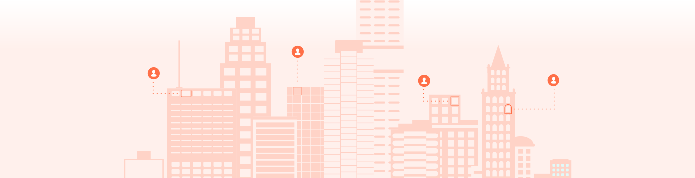


<section class="emergencyServicesAbout">


# 911 Access Dashboard

The [911 Access Dashboard](https://dashboard.dashcs.com/) allows you to easily provision phone numbers and pair them with a verified address. Use the 911 Access Dashboard or our APIs to quickly update or add user endpoints and get real-time error correction for more precise call routing and improved emergency response.

  * [911 Access Dashboard API Guide](https://support.bandwidth.com/hc/en-us/articles/115006226067-911-Dashboard-API-guide)
  * [911 Access Dashboard API Guide (for Windstream)](https://support.bandwidth.com/hc/en-us/articles/360053330374-Windstream-s-911-Dashboard-API-guide)
