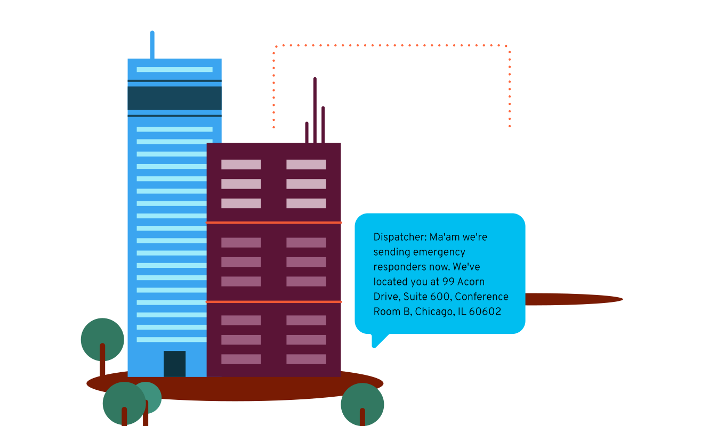


<section class="emergencyServicesAbout">


# 911 Dynamic Location Routing

[Dynamic Location Routing](https://support.bandwidth.com/hc/en-us/articles/360006080074-911-Dynamic-Location-Routing-integration-guide) allows you to leverage a user’s location at the time of a 911 call. Use the [Bandwidth Dashboard](https://dashboard.bandwidth.com/) to manage your locations through our portal or APIs.

When a call is placed, DLR pairs the caller’s information with their current location using defined network elements such as subnets, WiFi access points, and Ethernet switches/ports. This information is then used to route the call and is made available for display at the destination public safety answering point (PSAP).

  * [Integration Guide](https://support.bandwidth.com/hc/en-us/articles/360006080074-911-Dynamic-Location-Routing-integration-guide)
  * [Emergency Calling API Integration Guide](https://support.bandwidth.com/hc/en-us/articles/360043368054-Emergency-Calling-API-integration-guide)
