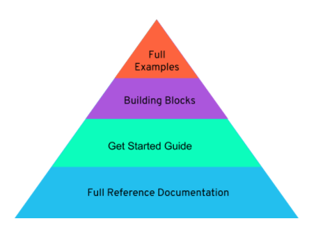

# About the Docs

Bandwidth's documentation is split into 4 main sections including the full reference docs, a get started guide, the building blocks, and full examples.

## Full Reference Documents

Detailed information about each of the API's methods and parameters. All specifications can be found in the full reference docs.

## Get Started Guide

**Beginners should start here.** This guide goes step by step through implementing Bandwidth's API into an application. It covers how to download the software and walks through an example of how to sending a text message and make a call.

## Building Blocks
Code blocks that can be copied and pasted into a program to implement a basic method. To build an application, begin by downloading the frame starter code and add your credentials. Copy and paste building blocks to piece together a working application.

## Full Examples
These are fully deployable demos that can be downloaded and immediately used. Make sure to change the credentials before trying the code.

