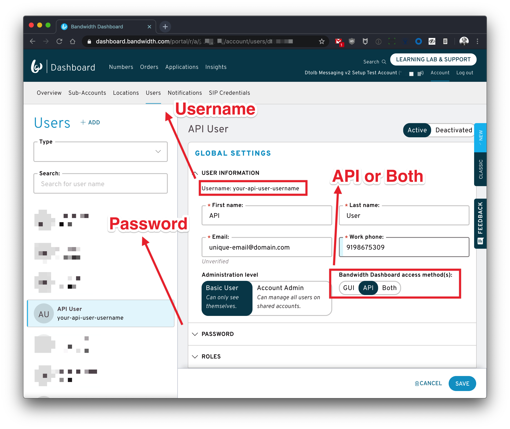
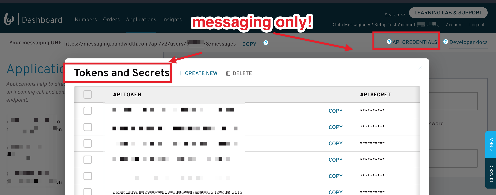

# Account Credentials {#top}

This guide will cover the different credentials for interacting with Bandwidth's APIs, and how to authenticate on each API.

## Basic Authorization

All of Bandwidth's APIs are protected with Basic Authorization over HTTPS. Basic Authorization requires the credential pair to be encoded with [base64](https://en.wikipedia.org/wiki/Base64) as part of the `Authorization` HTTP header.

### Credentials Snapshot {#snap-shot}

| Credential Name | Description                                                                                                                                                        | Example                                            |
|:----------------|:-------------------------------------------------------------------------------------------------------------------------------------------------------------------|:---------------------------------------------------|
| `username`      | The **username** of your **API Credentials** for the [Bandwidth Dashboard](https://dashboard.bandwidth.com)                                                        | `jdoe`                                             |
| `password`      | The **password** of your **API Credentials** for the  [Bandwidth Dashboard](https://dashboard.bandwidth.com)                                                       | `correct-horse-battery-staple`                     |
| `accountId`     | Your unique account **id**.  The `accountId` is used as part of the url to make API requests.   Ex: `https://dashboard.bandwidth.com/api/accounts/{accountId}/` | `920012`                                           |
| `apiToken`      | **Messaging Only** Your unique api token.  The `apiToken` is used as the **username** to authenticate to the API as part of the basic auth scheme                  | `f12a9edeed04ecd21b303c6f1f9f0831a1482f7f3c59199e` |
| `apiSecret`     | **Messaging Only** Your unique api secret.  The `apiSecret` is used as the **password** to authenticate to the API as part of the basic auth scheme                | `j54935lddasl837592356aasdf8359hlo3`               |

## Creating the API Credentials

Bandwidth provides a 'user-based' permission and authentication scheme (with the exception of the [Messaging API](#messaging)). It's recommended to [create a new user](https://support.bandwidth.com/hc/en-us/articles/115007187088-How-to-Create-New-Users-in-the-Bandwidth-Dashboard) with **ONLY** API access and the possible "roles on your account".

It's worth noting the other user types besides API are forced to update password every 90 days.

## API Credentials (Voice, Numbers, Account Management) {#voice-numbers-account}

All three of Voice, Numbers, & Account Management APIs leverage your API Credentials created specifically for API access.  The API Credential pair for Voice, Numbers, & Account Management must be created as a unique set within Dashboard.  Learn more about creating your API Credentials in the [support article](https://support.bandwidth.com/hc/en-us/articles/115007187088-How-to-Create-New-Users-in-the-Bandwidth-Dashboard).

⚠️ The API Credential pair are generally separate from your **Login Username & Password** and **should not** be used to access the dashboard.  Further, your login username and password **should not** be used to access the Voice, Numbers, & Account Management APIs.

### Voice Credentials Needed

| Credential Name | How it is used                                                                                         |
|:----------------|:-------------------------------------------------------------------------------------------------------|
| `accountId`     | Used as a URL parameter for the API endpoint `https://voice.bandwidth.com/api/v2/accounts/{accountId}` |
| `username`      | Used as the username for HTTP basic auth                                                               |
| `password`      | Used as the password for HTTP basic auth                                                               |

### Numbers & Account Management Credentials Needed

| Credential Name | How it is used                                                                                          |
|:----------------|:--------------------------------------------------------------------------------------------------------|
| `accountId`     | Used as a URL parameter for the API endpoint `https://dashboard.bandwidth.com/api/accounts/{accountId}` |
| `username`      | Used as the username for HTTP basic auth                                                                |
| `password`      | Used as the password for HTTP basic auth                                                                |

## Token & Secret (Messaging Only) {#messaging}

Bandwidth's Messaging API leverages server-side generated API Token & API Secrets. Learn more about creating and managing Tokens and Secrets in the [support article](https://support.bandwidth.com/hc/en-us/articles/360014110974).

### Messaging Credentials Needed

| Credential Name | How it is used                                                                                                   |
|:----------------|:-----------------------------------------------------------------------------------------------------------------|
| `accountId`     | Used as a URL parameter for the API endpoint `https://messaging.bandwidth.com/api/v2/users/{accountId}/messages` |
| `apiToken`      | Used as the username for HTTP basic auth                                                                         |
| `apiSecret`     | Used as the password for HTTP basic auth                                                                         |

 
