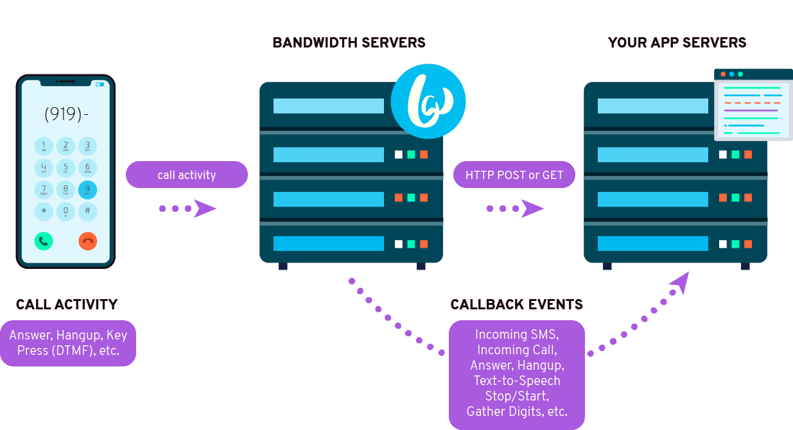

# Bandwidth Callbacks

## Bandwidth Callbacks Overview

Bandwidth's APIs operate on a system of callbacks. Most API requests send callbacks, and notices of incoming events (phone call, text message) are sent via callbacks as well.

## How To Utilize Callbacks

In order to utilize callbacks, you must run a server with a URL that is expecting to receive callbacks from Bandwidth. This URL must be provided to Bandwidth through your Bandwidth application settings, or as part of your API request. For voice callbacks, this endpoint must return valid BXML for Bandwidth to use. More information on Bandwidth applications can be found on our [applications page](../../applications/about.md).

Callback URLs can (and ideally should) be password protected. To allow Bandwidth to access these URLs, applications in the Bandwidth Dashboard can be configured with a username and password used to authenticate on your callback URL.

Only ports 80 and 443 are supported for callbacks.

If you need static IPs for your callbacks, feel free to open up a ticket on our [support site](https://support.bandwidth.com/hc/en-us/requests/new).

## Specific Callback Information For Bandwidth's APIs

### Voice Callbacks

Specifics for voice callbacks can be found on our [voice callbacks page](../../voice/bxml/callbacks/about.md)

Bandwidth expects to receive valid [BXML](../../voice/bxml/about.md) as a response for BXML callbacks

### Messaging Callbacks

Specifics for messaging callbacks can be found on our [messaging callbacks page](../../messaging/callbacks/messageEvents.md)

 
