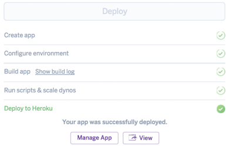
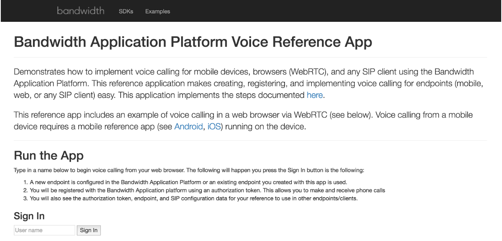
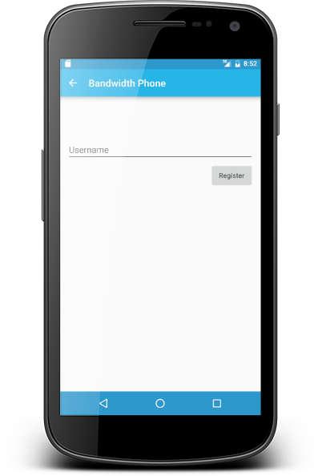
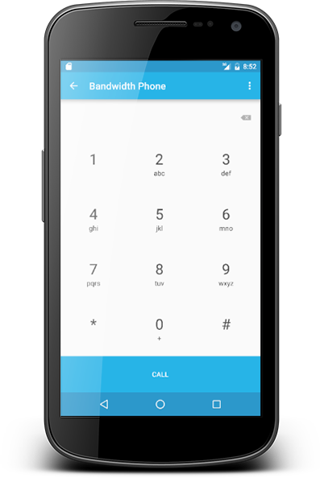

# Acrobits Mobile SDK Quick Start Guide

This guide shows you how to get up and running with the Acrobits SDK with an example client app. The example app is available for both Android and iOS.

1. Setup server componet
2. Download example from github
3. Launch mobile app & register with server

## Prerequisites

* Working Android Studio at least v2.1 _-or-_ XCode at least v7.3
* Bandwidth Account: [Sign up](https://catapult.inetwork.com/portal/signup)
* Basic understanding of:
 * Github
 * iOS/Android Dev Enivornments
 * Heroku account: [Sign up](https://signup.heroku.com/)

## Running the server

The server component is an example server-side application that exposes a simple API that shows how a mobile app would register to receive an endpoint and credentials. The server app also handles the call flow events from the App Platform API. The server apps are available in GitHub and can be deployed to Heroku with a one button deployment. These are available in Node, Ruby, and C#. We’ll use the Ruby app in this tutorial.

| Server Language                  | Link                                                                      | Deploy                                                                                                                                                                                                                                                                           |
|:---------------------------------|:--------------------------------------------------------------------------|:---------------------------------------------------------------------------------------------------------------------------------------------------------------------------------------------------------------------------------------------------------------------------------|
| Node                             | [Github](https://github.com/BandwidthExamples/node-voice-reference-app)   |                                                                                                                        |
| Ruby **- Used in this tutorial** | [Github](https://github.com/BandwidthExamples/ruby-voice-reference-app)   |                                                                                                                        |
| C#                               | [Github](https://github.com/BandwidthExamples/csharp-voice-reference-app) |  |

There are two ways to deploy the server app from GitHub:
 1. Use the 1 button deployment to Heroku
 2. Download the app, build it and deploy it to the environment of your choice.

### Deploying to Heroku

When you press that button, you are taken to your Heroku screen to enter information from your App Platform API account.

You can find that information from the App Platform Dev Console, by clicking the Account tab

Enter it and click the Deploy button. When Heroku is finished, you’ll see `Your app was successfully deployed`.

### Make note of the server URL

Click the View button to see the App Home page and, especially, to note the URL. Save that URL, you’ll need it to launch the mobile app.

That’s it!! You’re done with the server component.
You’ll want to view the docs and source code to learn more how this component works, but this is sufficient to demonstrate the example Mobile app. One important note - the example server component is not a production ready server! It’s an example of how to use the App Platform APIs to integrate with a Mobile application. To harden for production is beyond the scope of this tutorial.

## Running the mobile app

To run the example Mobile App, you need a working XCode or Android Studio environment. Setting up this environment is beyond the scope of this document, but there are multiple books and online tutorials that cover this. This document focuses on the Android environment, but the same concepts apply to XCode.

| Mobile OS | Link                                                                            |
|:----------|:--------------------------------------------------------------------------------|
| Android   | [Github](https://github.com/bandwidthcom/catapult-reference-app-voice-android/) |
| iOS       | [Github](https://github.com/bandwidthcom/catapult-reference-app-voice-ios/)     |

Start by pulling the app down from Github (see instructions in README.md). Open this directory in Android Studio by selecting the ‘Open an Existing Android Studio App’ option.

Open the strings.xml file and replace the `application_server_url` property with the URL from deploying the server code. If you deployed to Heroku, it’ll look something like this – `https://thawing-spire-92827.herokuapp.com/index.html`

| Step                                                                                                                                                                                 | Screenshot                                |
|:-------------------------------------------------------------------------------------------------------------------------------------------------------------------------------------|:------------------------------------------|
| Launch the Mobile App, either as a virtual device or on a specific hardware device.   When the application launches, the register screen is displayed                             |   |
| You can enter any username and the reference app contacts the server for:   - A new endpoint   - Telephone number   When registration is complete, the dialer is displayed. |  |
| From here you can make and receive calls to any telephone number. Open Settings to see:   - The Bandwidth number   - The endpoint   - The domain   - The server url      |   |

## Testing
You can test some of the advanced features of the Acrobits SDK like the cell/wifi hand-off as follows:

1. Complete a call to another phone using the device and carrier cell. Verify that voice is heard on both devices.
2. Disable the cell coverage by putting the device in airplane mode and verifying that the call is still active, but not sending or receiving voice.
3. Enable wifi on the device, leaving airplane mode on. Verify that voice is, again, enabled.

To see push notifications in action, see the Push Notification with Acrobits Tutorial.
