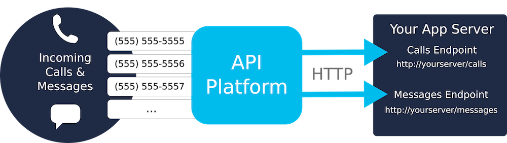



## Incoming Call & Messaging (REST)

Incoming calls and messages are sent to a web address configured in [`applications`](http://dev.bandwidth.com/ap-docs/methods/applications/applications.html).



In order to recieve incoming call and messaging events, you'll need to:

1. [Create an application](http://dev.bandwidth.com/ap-docs/methods/applications/postApplications.html)
2. [Order a phone number](http://dev.bandwidth.com/ap-docs/methods/availableNumbers/postAvailableNumbersLocal.html)
3. [Assign the phone number to the application](http://dev.bandwidth.com/ap-docs/methods/phoneNumbers/postPhoneNumbersNumberId.html)

### Example: Setup an application and order phone number



```js
//NodeJS

var Bandwidth = require("node-bandwidth");

var client = new Bandwidth({
	userId    : "{{userId}}",
	apiToken  : "{{apiToken}}",
	apiSecret : "{{apiSecret}}"
});

// Need to use the id of the new application when ordering phone number
var appId;

//Parameters for creating new application
var appPayload = {
	name: "MyFirstApp", // Name
	incomingCallUrl: "http://example.com/calls", //Callback URL for phone calls
	incomingMessageUrl : "http://example.com/messages" //Callback URL for messages
};

//Create the application
client.Application.create(appPayload)
.then(function (response) {
	appId = response.id;
	console.log("Application ID: " + appId);
	return client.Application.get(appId);
})
.then(function (application) {
	console.log("Application Name: " + application.name);
	//Search for phone numbers in North Carolina
	return client.AvailableNumber.search("local", {state:"NC"});
})
.then(function (availableNumbers) {
	//Parameters for ordering the phone number
	var phoneNumberPayload = {
		//Be sure to set the applicationId to the id of application created
		applicationId : appId,
		number : availableNumbers[0].number,
		name : availableNumbers[0].nationalNumber
	}
	//Order the phone number
	return client.PhoneNumber.create(phoneNumberPayload);
})
.then(function (phoneNumber) {
	console.log("Phone Number ID: " + phoneNumber.id);
})
.catch(function (e) {
	console.error(e);
	throw e;
});
```



```csharp
//Download the .net sdk from ap.bandwidth.com/docs/helper-libraries/net

using System;
using System.Threading.Tasks;
using Bandwidth.Net;
using Bandwidth.Net.Api;

public class Program
{
  //API credentials which can be found on your account page at https://catapult.inetwork.com/pages/login.jsf
  private const string UserId = "{{userId}}"; //{user_id}
  private const string Token = "{{apiToken}}"; //{token}
  private const string Secret = "{{apiSecret}}"; //{secret}

  public static void Main()
  {
    try
    {
      RunAsync().Wait();
    }
    catch (Exception ex)
    {
      Console.Error.WriteLine(ex.Message);
      Environment.ExitCode = 1;
    }
  }

  private static async Task RunAsync()
  {
    var client = new Client(UserId, Token, Secret);

    var app = await client.Application.CreateAsync(new CreateApplicationData
    {
      Name = "MyFirstApp",
      IncomingCallUrl = "http://example.com/calls.php",
      IncomingMessageUrl = "http://example.com/messages.php",
      CallbackHttpMethod = CallbackHttpMethod.Post,
      AutoAnswer = true
    });

    await client.PhoneNumber.UpdateAsync("{numberId}", new UpdatePhoneNumberData {ApplicationId = app.Id});
  }
}
```
