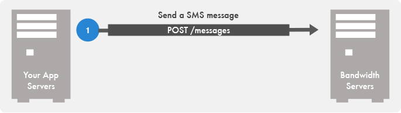


## Send SMS/MMS
*_This example shows you how to send an outbound SMS or MMS message to a mobile phone._*



### Running Examples

* Find your credentials for all examples in your [account tab](../security.md)
* Replace the <code class="delete">from</code> number with a Bandwidth Number](howto/buytn.md)
* Replace the <code class="delete">to</code> number with your cell phone number.

### Using PostMan

<a href="https://app.getpostman.com/run-collection/8aec904a67e85cbbede2" class="aimg"></a>

* Import the example to Postman by clicking the button and access it in “Collections”.
* Replace the following in Postman Authorization with _YOUR_  information from the [Account](../security.md) tab.
    * `{userId}`
    * `{token}`
    * `{secret}`
* Replace the following in the Postman body. You **WILL NEED** a [Bandwidth Number](buytn.md)
    * `"from": "bandwidthNumber"` : With a the Bandwidth telephone number.
    * `"to": "toNumber"` : With your cell phone number.

### Receive Incoming Messages

To recieve incoming text messages and multimedia messages. You must have the `phonenumber` assigned to an `application` with a valid `messagingCallbackUrl`.

Learn how to configure incoming messages in [this guide](incomingCallandMessaging.md).


### Example 1 of 2: Send a SMS



```bash
curl -v -X POST https://api.catapult.inetwork.com/v1/users/{userId}/messages \
    -u {token}:{secret} \
    -H "Content-type: application/json" \
    -d \
    '{
        "from": "+12525089000",
        "to": "+15035555555",
        "text": "Hello there from Bandwidth!"
    }'
```



```js
// install sdk: npm install node-bandwidth

var Bandwidth = require("node-bandwidth");
var client = new Bandwidth({
    userId    : "YOUR_USER_ID",
    apiToken  : "YOUR_API_TOKEN",
    apiSecret : "YOUR_API_SECRET"
});
var message = {
    from: "+19195551212", // <-- This must be a Bandwidth number on your account
    to: "+191955512142",
    text: "Hello World"
};

client.Message.send(message)
.then(function(message) {
    console.log("Message sent with ID " + message.id);
})
.catch(function(err) {
    console.log(err.message);
});
```



```csharp
//Download the .net sdk from dev.bandwidth.com/clientLib/csharp.html

using System;
using System.Threading.Tasks;
using Bandwidth.Net;
using Bandwidth.Net.Api;

public class Program
{
  private const string UserId = "u-userID"; //{user_id}
  private const string Token = "t-token"; //{token}
  private const string Secret = "secret"; //{secret}

  public static void Main()
  {
    try
    {
      RunAsync().Wait();
    }
    catch (Exception ex)
    {
      Console.Error.WriteLine(ex.Message);
      Environment.ExitCode = 1;
    }
  }

  private static async Task RunAsync()
  {
    var client = new Client(UserId, Token, Secret);

    var sms = await client.Message.SendAsync(new MessageData
    {
      From = "+19195551212", // <-- This must be a Bandwidth number on your account
      To = "+191955512142",
      Text = "Hello World"
    });
  }
}
```




```ruby
message = Message.create(client, {
    :from => "+19195551212", # <-- This must be a Bandwidth number on your account
    :to => "+19195551213",
    :text => "Thank you for susbcribing to Unicorn Enterprises!"
})
```


### Example 2 of 2: Send a MMS (Picture Messaging)



```bash
curl -v -X POST https://api.catapult.inetwork.com/v1/users/{userId}/messages \
    -u {token}:{secret} \
    -H "Content-type: application/json" \
    -d \
    '
    {
        "from": "+12018994225",
        "to": "+12223334444",
        "text": "Hello there from Bandwidth!",
        "media":["https://s3.amazonaws.com/bwdemos/logo.png"]
    }'
```



```js
// install sdk: npm install node-bandwidth

var Bandwidth = require("node-bandwidth");
var client = new Bandwidth({
    userId    : "YOUR_USER_ID",
    apiToken  : "YOUR_API_TOKEN",
    apiSecret : "YOUR_API_SECRET"
});
var message = {
    from: "+19195551212", // <-- This must be a Bandwidth number on your account
    to: "+191955512142",
    text: "Test",
    media: ["https://s3.amazonaws.com/bwdemos/logo.png"]
};

//Use Promises
client.Message.send(message)
.then(function(message) {
    console.log("Message sent with ID " + message.id);
})
.catch(function(err) {
    console.log(err.message);
});
```




```csharp
//Download the .net sdk from http://dev.bandwidth.com/clientLib/csharp.html

using System;
using System.Threading.Tasks;
using Bandwidth.Net;
using Bandwidth.Net.Api;

public class Program
{
  private const string UserId = "u-userID"; //{user_id}
  private const string Token = "t-token"; //{token}
  private const string Secret = "secret"; //{secret}

  public static void Main()
  {
    try
    {
      RunAsync().Wait();
    }
    catch (Exception ex)
    {
      Console.Error.WriteLine(ex.Message);
      Environment.ExitCode = 1;
    }
  }

  private static async Task RunAsync()
  {
    var client = new Client(UserId, Token, Secret);

    var mms = await client.Message.SendAsync(new MessageData
    {
      From = "+19195551212", // <-- This must be a Bandwidth number on your account
      To = "+191955512142",
      Text = "Test",
      Media = new[] {"https://s3.amazonaws.com/bwdemos/logo.png"}
    });
  }
}
```



```ruby
message = Message.create(client, {
    :from => "+19195551212", #<-- This must be a Bandwidth number on your account
    :to => "+19195551213",
    :text => "Thank you for susbcribing to Unicorn Enterprises!",
    :media => ["https://s3.amazonaws.com/bwdemos/logo.png"]
})
```


