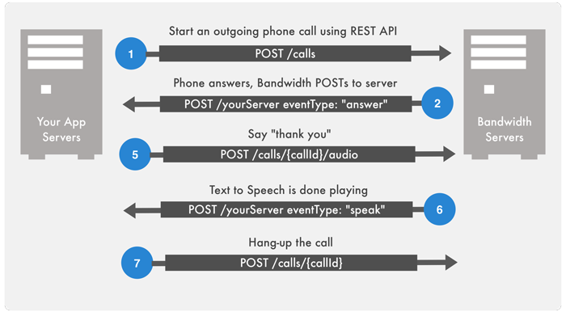
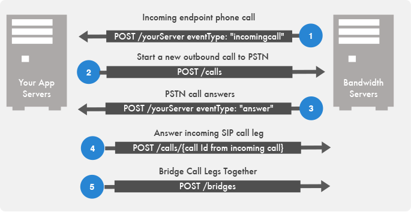
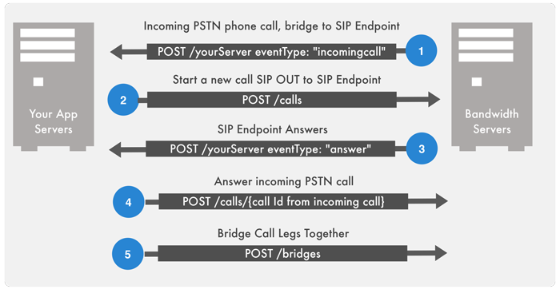




# SIP Clients & Registering SIP Endpoints

This guide shows how to get started with SIP endpoints for SIP Phones, Mobile Clients, Web Clients and IP Phones.


## Prerequisites

* Create an [`/applications`](incomingCallandMessaging.md) resource; set your `incomingCallUrl` to your server with `{"autoAnswer":false}`
* Configure an incoming phone number associated with your application - in this example, +1555444333 is the Bandwidth phone number on your account.
* Your account is enabled for domains. Contact us to enable your account.


## Overview
Bandwidth SIP endpoints allow you to register end-user SIP phone devices directly to the App Platform and extend the ability to manage call control to SIP devices such as mobile clients and IP phones.

In this tutorial, you will learn how to:
 1. Create a unique SIP domain for your service to use (LIMIT: each account can have a max. 100 domains)
 2. Create an endpoint/user. You'll associate the endpoint both with your domain and with an application for incoming SIP calls
 3. Make a phone call to your endpoint/user
 4. Receive an incoming call from your SIP endpoint. You'll then bridge the call to the Public Switched Telephone Network (PSTN)
 5.Receive incoming phone calls from the PSTN. You'll then bridge the call to a SIP endpoint


## Step 1 - Create a unique domain for your service to use

A domain is a way to logically group endpoints.  The name of the domain will be part of a public DNS record.  For that reason, we let the customer choose their domain names.  Once a domain has been created, endpoints can be created and managed within the context of the domain.  Because endpoints can only exist within the context of a domain, creating a domain is the first step in creating endpoints.


<code class="post">POST</code>`/v1/users/{user-id}/domains`

```json
{
  "name": "xyz-corp-testing",
  "description": "Testing Demo Domain"
}
```

```
HTTP/1.1 201 Created
Location: /v1/users/{user-id}/domains/{domain-id}
```


## Step 2 - Create an endpoint/user
An endpoint represents an entity that can register with the Bandwidth App Platform Registrar and place and receive calls.  An endpoint is addressable using a unique SIP URI which is constructed using the endpoint's user name and the domain in which the endpoint exists.

> E.g. **user1234@xyz-corp-testing.bwapp.bwsip.io**

There are no restrictions on the number of SIP clients that can be associated with an endpoint.  That is, an application can create one endpoint in the Bandwidth App Platform and give the SIP URI and credentials to as many of their own clients as it likes.  However, when a call is made to the SIP URI for that endpoint, all clients registered as that endpoint (using that SIP URI and credentials to register) will receive the call.  The call will be completed to the first client that answers.

If you don't want all your SIP clients to ring simultaneously, create an endpoint for each client.  You can still associate a single phone number with a group of clients, but the application has more control over which client will ring when that number is called.

> NOTE: You must associate an “application-id” with your endpoint to receive events from your endpoint. See the [`/applications`](http://dev.bandwidth.com/ap-docs/extendmethods/applications/applications.html) resource for how to create an application id.

<code class="post">POST</code>`/v1/users/{user-id}/domains/{domain-id}/endpoints`

```json
{
	"name" : "jsmith_mobile",
	"description" : "John Smiths mobile client",
	"domainId" : "{domain-id}",
	"applicationId" : "{application-id}",
	"enabled" : "true",
	"credentials" : { "password" : "abc123" }
}
```
```
HTTP/1.1 201 Created
Location: /v1/users/{user-id}/domains/{domain-id}/endpoints/{endpoint-id}
```

## Step 3 - Make a phone call to your endpoint/user

For testing purposes, download a SIP client like [yate](http://yateclient.yate.ro) and setup your username, password and realm, you can retrieve your endpoints as follows.

<code class="get">GET</code>`/v1/users/{user-id}/domains/{domain-id}/endpoints`

```json
200 OK
Content-Type: application/json
[
  {
    "id": "re-6dd6kudwpxo3672peoycsgq",
    "name": "jsmith_mobile",
    "domainId": "rd-3kfl2yi4ja6npquwxpnpqji",
    "enabled": true,
    "applicationId": "a-qjbpfmrr46qf2lklgc72tvy",
    "sipUri": "sip:jsmith_mobile@xyz-corp-testing.bwapp.bwsip.io",
    "credentials": {
      "realm": "xyz-corp-testing.bwapp.bwsip.io",
      "username": "jsmith_mobile "
    }
  }
]
```

Be sure your SIP client is registered on the network, in Yate Client for example, you will see an “online” status.


Next, make a call to your SIP client using the App Platform APIs. The flow for this is shown here:



The API calls for each sequence in this flow is described below:


### 1: Create a New Outbound Call

Create a New Outbound Call to Your SIP Endpoint. You can start a new outbound call to your SIP endpoint, **be sure to set the callbackUrl so you can detect the ‘answer’ event for the next step.**

<code class="post">POST</code>`v1/users/{user-id}/calls`


### Create a New Outbound Call



```json
{
  "from": "+1555444333",
  "to": "sip:jsmith_mobile@xyz-corp-testing.bwapp.bwsip.io",
  "callbackUrl" : "http://yourserver.com"
}
```

```
HTTP/1.1 201 Created
Location: /v1/users/{userId}/calls/{callId}
```



### 2: Receive Answer event

Outbound call - receive an [`answer`](http://dev.bandwidth.com/ap-docs/apiCallbacks/answer.html) event from Bandwidth. When the SIP client answers the call, Bandwidth will POST to your callback URL the `answer` event that you will use to say something to the caller.

<code class="post">POST</code>`http://yourwebserver.com`


### Receive Answer event



```json
{
   "callState":"active",
   "from":"+1555444333",
   "time":"2014-06-13T22:37:05Z",
   "to":"sip:jsmith_mobile@xyz-corp-testing.bwapp.bwsip.io",
   "eventType":"answer",
   "callId":"c-m6dz5lqurhhxnn7is6v3w4y",
   "callUri": "https://api.catapult.inetwork.com/v1/users/{user-id} /calls/{call-id}"
}
```



### 3: Speak Sentence

Use the [speak sentence](http://dev.bandwidth.com/ap-docs/extendmethods/calls/postCallsCallIdAudio.html) to speak “Hello SIP Client”. 
<code class="post">POST</code>`v1/users/{user-id}/calls/{call-id}/audio`


### Speak Sentence



```json
{
  "gender": "female",
  "voice": "kate",
  "sentence": "Hello sip client",
  "locale": "en_US"
}
```

```
200 OK
```



### 4: Receive Speak Event

Detect when “speaking” is done. To know when speaking completes, you will receive a [callback](http://dev.bandwidth.com/ap-docs/apiCallbacks/speak.html) `{"eventType": "speak", "status": "done"}`.

<code class="post">POST</code>`http://yourwebserver.com`


### Receive Speak Event


```json
{
   "time":"2014-06-17T01:14:30Z",
   "eventType":"speak",
   "status":"done",
   "state":"PLAYBACK_STOP",
   "callId":"c-m6dz5lqurhhxnn7is6v3w4y",
   "callUri": "https://api.catapult.inetwork.com/v1/users/{user-id{/calls/{call-id}"
}
```



### 5: Hang-up the call

After the text to speech completes, you can simply [hangup](http://dev.bandwidth.com/ap-docs/extendmethods/calls/postCallsCallId.html).  

<code class="post">POST</code>`/v1/users/{user-id}/calls/{call-id}`


### Hang-up the call



```json
{
   "state": "completed"
}
```

```
200 OK
```



## Step 4 - Receive an incoming call from your SIP endpoint

When a SIP client makes a call, you will receive an “<a title="Incoming Call Event" href="http://ap.bandwidth.com/docs/callback-events/voice-calls/incoming-call-event/">incomingcall</a>” event from that SIP client, you can choose what to do. In most basic use case, you will simply want to start an outbound call to the PSTN and bridge the calls together. The flow for this is shown here:



The API calls for each sequence in this flow is described below:


### Step 1: Receive an Incoming Call Event

**Receive an Incoming Call Event from your SIP Endpoint**. Note that your application is set for autoAnswer = false so the call will ring until you answer it in sequence 4 below.

<code class="post">POST</code>`http://yourwebserver.com`


### Receive an Incoming Call Event



```json
{
   "callState":"active",
   "to":"+15552223333",
   "time":"2014-06-13T22:37:05Z",
   "from":"sip:jsmith_mobile@xyz-corp-testing.bwapp.bwsip.io",
   "eventType":"incomingcall",
   "callId":"c-m6dz5lqurhhxnn7is6v3w4y",
   "callUri": "https://api.catapult.inetwork.com/v1/users/{user-id} /calls/{call-id}"
}
```



### Step 2: Create a New Outbound Call to the PSTN.

**Create a New Outbound Call to the PSTN.** You can start a new outbound call to your SIP endpoint, **be sure to set the callbackUrl so you can detect the ‘answer’ event for the next step.**

<code class="post">POST</code>`/v1/users/{user-id}/calls`


### Create a New Outbound Call to the PSTN.



```json
{
  "from": "+1555444333",
  "to": "+15552223333",
  "callbackUrl" : "http://yourserver.com"
}
```

```
HTTP/1.1 201 Created
Location: /v1/users/{userId}/calls/{callId}
```



### Step 3: Receive an ‘answer’ event from Bandwidth
**Outbound call - receive an ‘answer’ event from Bandwidth.** When the PSTN call answers the call, Bandwidth will POST to your callback URL the [`answer`](http://dev.bandwidth.com/ap-docs/apiCallbacks/answer.html) event that you will use to trigger answering the SIP client call leg and bridging the calls together.

<code class="post">POST</code>`http://yourwebserver.com`


### Receive an ‘answer’ event from Bandwidth



```json
{
   "callState":"active",
   "from": "+1555444333",
   "to": "+15552223333",
   "time":"2014-06-13T22:37:05Z",
   "eventType":"answer",
   "callId":"c-m6dz5lqurhhxnn7is6v3w4y",
   "callUri": "https://api.catapult.inetwork.com/v1/users/{user-id} /calls/{call-id}"
}
```


**Answer the call.**


<code class="post">POST</code>/v1/users/{user-id}/calls/{call-id}

```json
{
   "state": "active"
}
```

```
200 OK
```


**Bridge calls together.**


<code class="post">POST</code>/v1/users/{userId}/bridges

```json
{
  "callIds":  ["{callId1}","{callId2}"]
}
```

```
HTTP/1.1 201 Created
Location: /v1/users/{userId}/calls/{bridgeId}
```


## Step 5 - Receive incoming phone calls from the PSTN

In this step you'll receive the incoming call from the PSTN and bridge it to your SIP endpoint. The flow for this is shown here:



The API calls for each sequence in this flow is described below:


### Step 1: Receive an Incoming Call Event from PSTN

**Receive an Incoming Call Event from PSTN**. Note that your application is set for autoAnswer = false so the call will ring until you answer it in sequence 4 below.

<code class="post">POST</code>`http://yourwebserver.com`


### Receive an Incoming Call Event from PSTN



```json
{
   "callState":"active",
   "from":"+12223334444",
   "time":"2014-06-13T22:37:05Z",
   "to":"+1555444333",
   "eventType":"incomingcall",
   "callId":"c-m6dz5lqurhhxnn7is6v3w4y",
   "callUri": "https://api.catapult.inetwork.com/v1/users/{user-id} /calls/{call-id}"
}
```



### Step 2: Create a New Outbound Call to the PSTN
**Create a New Outbound Call to the PSTN**. You can start a new outbound call to your SIP endpoint, **be sure to set the callbackUrl so you can detect the ‘answer’ event for the next step.**

<code class="post">POST</code>`/v1/users/{user-id}/calls`


### Create a New Outbound Call to the PSTN



```json
{
  "from": "+1555444333",
  "to": "sip:jsmith_mobile@xyz-corp-testing.bwapp.bwsip.io",
  "callbackUrl" : "http://yourserver.com"
}
```

```
HTTP/1.1 201 Created
Location: /v1/users/{userId}/calls/{callId}
```



### Step 3: Receive an ‘answer’ event from Bandwidth
**Outbound SIP call - receive an ‘answer’ event from Bandwidth**. When the call answers the call, Bandwidth will POST to your callback URL the [`answer`](http://dev.bandwidth.com/ap-docs/apiCallbacks/answer.html) event that you will use to trigger answering the PSTN call leg and bridging the calls together.

<code class="post">POST</code> http://yourwebserver.com


### Receive an ‘answer’ event from Bandwidth


```json
{
   "callState":"active",
   "from": "+1555444333",
   "to": "sip:jsmith_mobile@xyz-corp-testing.bwapp.bwsip.io",
   "time":"2014-06-13T22:37:05Z",
   "eventType":"answer",
   "callId":"c-m6dz5lqurhhxnn7is6v3w4y",
   "callUri": "https://api.catapult.inetwork.com/v1/users/{user-id} /calls/{call-id}"
}
```


**Answer the call.**


<code class="post">POST</code>/v1/users/{user-id}/calls/{call-id}

```json
{
   "state": "active"
}
```

```
200 OK
```


**Bridge calls together.**

<code class="post">POST</code>/v1/users/{userId}/bridges

```json
{
  "callIds":  ["{callId1}","{callId2}"]
}
```

```
HTTP/1.1 201 Created
Location: /v1/users/{userId}/calls/{bridgeId}
```

