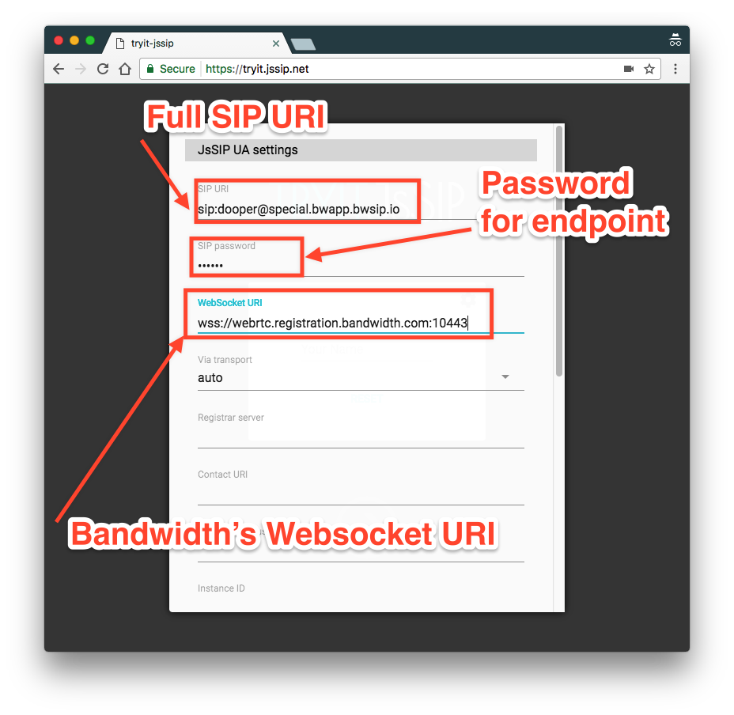
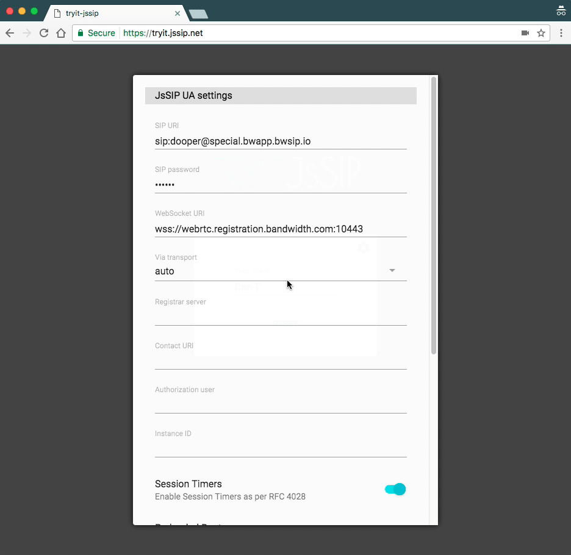

# JSSIP with Bandwidth Voice API

# ⚠️ Bandwidth no longer supports WebRTC per [`rtcpMuxPolicy`](https://www.chromestatus.com/features/5654810086866944)
Older versions of chrome _may_ still work. Please check back later for more information or [contact sales](mailto:letstalk@bandwidth.com) to check out status.

## Prerequisites

- Register for a Bandwidth Voice API account [here](https://catapult.inetwork.com)
- Follow the [SIP Guide](sip.md) to create a server to handle SIP incoming calls and PSTN Calls
- If you want to make calls to the PSTN (normal phones) you will need a server to handle events from Bandwidth
- Make phone calls

For a more in depth guide, view [this article](sip.md)

## Quick Start with JsSip

Once you have stood up a server to handle callbacks from Bandwidth **AND** [created a domain](https://dev.bandwidth.com/ap-docs/methods/domains/postDomains.html) with at least one [endpoint](https://dev.bandwidth.com/ap-docs/methods/endpoints/postEndpoints.html) that is associated with an application; you're ready to get started with SIP

### [https://tryit.jssip.net/](https://tryit.jssip.net/)

| Name          | Value                                                                                                          |
|:--------------|:---------------------------------------------------------------------------------------------------------------|
| SIP URI       | `sip:{endpoint_name}@{domain_name}.bwapp.bwsip.io`                                                             |
| SIP password  | value used when [creating the endpoint](https://dev.bandwidth.com/ap-docs/methods/endpoints/postEndpoints.html) |
| WebSocket URI | `wss://webrtc.registration.bandwidth.com:10443`                                                                |

Once *everything* is filled out click the `OK` button and set your name. Click the `->` arrow to load the WebRTC Demo

### Demo GIF

