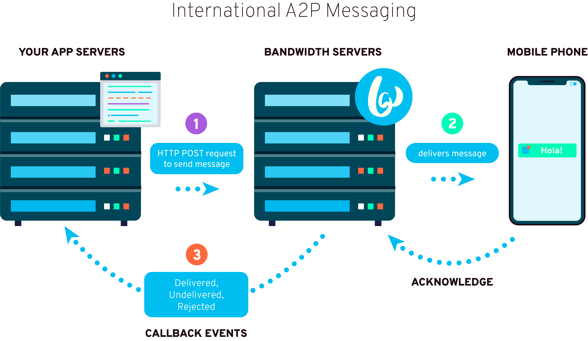




# Bandwidth International A2P Messaging {#top}

## Introduction

Bandwidth’s International A2P Messaging API enables customers to send SMS over HTTP/HTTPS and to receive Delivery Reports (DLRs) over via HTTP callbacks (webhooks).

## Table of contents

* [International A2P Concepts](#concepts)
* [Sending SMS messages](#send-sms)
  * [Create Message API](#create-message)
  * [HTTP Responses (Success & Errors)](#http-response)
* [Delivery Receipts (DLR) via HTTP Callbacks (webhooks)](#dlrs)
  * [DLR Format & Parameters](#http-dlr)
  * [DLR Error Codes](#dlr-errors)

## Concepts {#concepts}

Bandwidth's international A2P messaging API relies heavily on HTTP callbacks/webhooks.  Final message state (delivered, rejected, undelivered) is only delivered as a HTTP Callback/webhook.



Messages are submitted over HTTPS from customers to Bandwidth’s system. When Bandwidth’s system has information of what happened with the delivery of the message it will send (also over HTTPS) an event to the customer provided Callback DLR URL.

There are four cases:

* Delivered message (`DELIVERED`)
* Undelivered message (`UNDELIVERED`)
* Rejected message (`REJECTED`)
* Buffered (temporary undelivered) message (`BUFFERED`) followed by final DLR event, delivered (`DELIVERED`), undelivered (`UNDELIVERED`) or rejected (`REJECTED`)

When messages cannot be delivered as fast as possible due to temporary problems a buffered DLR event will be sent to Callback DLR URL if the customer has enabled non-final state notifications via the `dlrMask`.  If the customer has not enabled non-final state notifications, when the message has reached a terminal state, a DLR will be sent to the `dlrUrl`.


## Sending SMS messages {#send-sms}

Bandwidth’s International A2P Messaging API is highly customizable allowing you to format the messages based on your unique use-case.

Users can customize:
* Message Encoding
* Alphanumeric Sender

### Message Encoding

Bandwidth’s International A2P Messaging API allows customers format messages as either `GSM` or `Unicode`. Bandwidth split submitted messages into several segments or reject messages because they are too long. Customers are billed for each segment.

#### GSM character set


<table><tbody><tr><td>Dec</td><td></td><td>0</td><td>16</td><td>32</td><td>48</td><td>64</td><td>80</td><td>96</td><td>112</td></tr>
<tr><td></td><td>Hex</td><td>0</td><td>10</td><td>20</td><td>30</td><td>40</td><td>50</td><td>60</td><td>70</td></tr>
<tr><td>0</td><td>0</td><td>@</td><td>Δ</td><td>SP</td><td>0</td><td>¡</td><td>P</td><td></td><td>p</td></tr>
<tr><td>1</td><td>1</td><td>£</td><td>_</td><td>!</td><td>1</td><td>A</td><td>Q</td><td>a</td><td>q</td></tr>
<tr><td>2</td><td>2</td><td>$</td><td>Φ</td><td>“</td><td>2</td><td>B</td><td>R</td><td>b</td><td>r</td></tr>
<tr><td>3</td><td>3</td><td>¥</td><td>Γ</td><td>#</td><td>3</td><td>C</td><td>S</td><td>c</td><td>s</td></tr>
<tr><td>4</td><td>4</td><td>è</td><td>Λ</td><td>¤</td><td>4</td><td>D</td><td>T</td><td>d</td><td>t</td></tr>
<tr><td>5</td><td>5</td><td>é</td><td>Ω</td><td>%</td><td>5</td><td>E</td><td>U</td><td>e</td><td>u</td></tr>
<tr><td>6</td><td>6</td><td>ù</td><td>Π</td><td>&amp;</td><td>6</td><td>F</td><td>V</td><td>f</td><td>v</td></tr>
<tr><td>7</td><td>7</td><td>ì</td><td>Ψ</td><td>‘</td><td>7</td><td>G</td><td>W</td><td>g</td><td>w</td></tr>
<tr><td>8</td><td>8</td><td>ò</td><td>Σ</td><td>(</td><td>8</td><td>H</td><td>X</td><td>h</td><td>x</td></tr>
<tr><td>9</td><td>9</td><td>Ç</td><td>Θ</td><td>)</td><td>9</td><td>I</td><td>Y</td><td>i</td><td>y</td></tr>
<tr><td>10</td><td>A</td><td>LF</td><td>Ξ</td><td>*</td><td>:</td><td>J</td><td>Z</td><td>j</td><td>z</td></tr>
<tr><td>11</td><td>B</td><td>Ø</td><td>&lt;ESC&gt;</td><td>+</td><td>;</td><td>K</td><td>Ä</td><td>k</td><td>ä</td></tr>
<tr><td>12</td><td>C</td><td>ø</td><td>Æ</td><td>,</td><td>&lt;</td><td>L</td><td>Ö</td><td>l</td><td>ö</td></tr>
<tr><td>13</td><td>D</td><td>CR</td><td>æ</td><td>–</td><td>=</td><td>M</td><td>Ñ</td><td>m</td><td>ñ</td></tr>
<tr><td>14</td><td>E</td><td>Å</td><td></td><td>.</td><td>&gt;</td><td>N</td><td>Ü</td><td>n</td><td>ü</td></tr>
<tr><td>15</td><td>F</td><td>å</td><td>É</td><td>/</td><td>?</td><td>O</td><td>§</td><td>o</td><td>à</td></tr>
</tbody></table>


### Supported characters in alphanumeric sender

Standard letters and digits:
* 0123456789
* abcdefghijklmnopqrstuvwxyz
* ABCDEFGHIJKLMNOPQRSTUVWXYZ


<table><tbody>
<tr><th colspan="4">Special Characters</th></tr>
<tr><th colspan="2">Supported</th><th colspan="2">Not Supported</th></tr>
<tr><th>Character</th><th>ASCII Code</th><th>Character</th><th>ASCII Code</th></tr>
<tr><td>SPACE</td><td>0×20</td><td>$</td><td>0×24</td></tr>
<tr><td>!</td><td>0×21</td><td>@</td><td>0×40</td></tr>
<tr><td>“</td><td>0×22</td><td>[</td><td>0x5B</td></tr>
<tr><td>#</td><td>0×23</td><td>\</td><td>0x5C</td></tr>
<tr><td>%</td><td>0×25</td><td>]</td><td>0x5D</td></tr>
<tr><td>&amp;</td><td>0×26</td><td>^</td><td>0x5E</td></tr>
<tr><td>‘</td><td>0×27</td><td>_</td><td>0x5F</td></tr>
<tr><td>(</td><td>0×28</td><td>`</td><td>0×60</td></tr>
<tr><td>)</td><td>0×29</td><td>{</td><td>0x7B</td></tr>
<tr><td>*</td><td>0x2A</td><td>|</td><td>0x7C</td></tr>
<tr><td>+</td><td>0x2B</td><td>}</td><td>0x7D</td></tr>
<tr><td>,</td><td>0x2C</td><td>~</td><td>0x7E</td></tr>
<tr><td>–</td><td>0x2D</td><td>€</td><td></td></tr>
<tr><td>.</td><td>0x2E</td><td></td><td></td></tr>
<tr><td>/</td><td>0x2F</td><td></td><td></td></tr>
<tr><td>:</td><td>0x3A</td><td></td><td></td></tr>
<tr><td>;</td><td>0x3B</td><td></td><td></td></tr>
<tr><td>&lt;</td><td>0x3C</td><td></td><td></td></tr>
<tr><td>=</td><td>0x3D</td><td></td><td></td></tr>
<tr><td>&gt;</td><td>0x3E</td><td></td><td></td></tr>
<tr><td>?</td><td>0x3F</td><td></td><td></td></tr>
</tbody></table>

### Create Message API {#create-message}

#### Request URL

<code class="post">POST</code>`https://sms.a2pi.bandwidth.com:12021/bulk/sendsms`



### Supported Parameters

| Parameter  | Mandatory | Description                                                                                                                                                                                                         | Example                                              |
|:-----------|:----------|:--------------------------------------------------------------------------------------------------------------------------------------------------------------------------------------------------------------------|:-----------------------------------------------------|
| `type`     | Yes       | The type of message to send. <br>For the Bandwidth API, the only valid type is `"text"`                                                                                                                             | `"text"`                                             |
| `auth`     | Yes       | Authorization credentials for the Bandwidth International A2P Messaging API. <br> Please contact [support](https://support.bandwidth.com) to learn how to find these credentials to get started.                    | `{"username":"testuser", "password":"testpassword"}` |
| `sender`   | Yes       | The alphanumeric value to appear as the outbound message `sender`. See the **Supported Characters** table to learn mroe.                                                                                            | `"Test"`                                             |
| `receiver` | Yes       | The desired destination phone number of the end user                                                                                                                                                                | `"4179123456"`                                       |
| `dcs`      | Yes       | Specifies the encoding to use for the outbound message. See the **Message Encoding** information to learn more. <br>Valid values are: <br>-`"GSM"` for GSM encoding <br>-`"UCS"` for Unicode UTF-8 encoding         | `"GSM"`                                              |
| `text`     | Yes       | The text content to be sent to the `receiver`                                                                                                                                                                       | `"This is test message"`                             |
| `dlrMask`  | Yes       | Specifies which DLR values to send to the `dlrUrl`. Bandwidth recommends setting the code to `19` to receive all of `DELIVERED`, `UNDELIVERED`, `REJECTED` events.<br>See the `dlrMask` table for more information. | `19`                                                 |
| `dlrUrl`   | Yes       | The publicly addressable callback URL to send DLR information about the outbound message                                                                                                                            | `"http://my-server.com/dlrjson.php"`                 |

#### dlrMask values

Delivery events that Bandwidth’s International A2P Messaging API sends are listed below. Statuses marked with ‘final status’ are final delivery reports – no further delivery reports will be sent for message.

| Value | Callbacks Received | Message state | Description                                                                                                                                                                                                                            |
|:------|:-------------------|:--------------|:---------------------------------------------------------------------------------------------------------------------------------------------------------------------------------------------------------------------------------------|
| `1`   | `DELIVERED`        | Final         | Delivered to phone                                                                                                                                                                                                                     |
| `2`   | `UNDELIVERED`      | Final         | Non-Delivered to Phone                                                                                                                                                                                                                 |
| `4`   | `BUFFERED`         | Temporary     | Queued on SMSC<br>Queued on SMSC usually means that there was some problem delivering message to the mobile phone, and further DLRs will follow.<br>Queued on SMSC means that Bandwidth’s system sent message to destination network . |
| `8`   | `SENT_TO_SMSC`     | Temporary     | Delivered to SMSC,                                                                                                                                                                                                                     |
| `16`  | `REJECTED`         | Final         | Non-Delivered to SMSC                                                                                                                                                                                                                  |

ℹ️ DLR Mask set for each sent message can be combination of these values. For example, 1+2+16=19 means that all the final statuses will be reported (DELIVERED, UNDELIVERED, REJECTED).

| Value | Callbacks Received                                       |
|:------|:---------------------------------------------------------|
| `3`   | `DELIVERED` & `UNDELIVERED`                              |
| `19`  | **RECOMMENDED** `DELIVERED`, `UNDELIVERED`, & `REJECTED` |
| `31`  | All statuses                                             |




### Example 1 of 4: Text messages in GSM Encoding

```http
POST https://sms.a2pi.bandwidth.com:12021/bulk/sendsms HTTP/1.1
Content-Type: application/json; charset=utf-8

{
  "type"     : "text",
  "auth"     : {"username":"testuser", "password":"testpassword"},
  "sender"   : "BulkTest",
  "receiver" : "4179123456",
  "dcs"      : "GSM",
  "text"     : "This is test message",
  "dlrMask"  : 19,
  "dlrUrl"   : "http://my-server.com/dlrjson.php"
}
```

> Responds

```http
Status: 202 Accepted
Content-Type: application/json; charset=utf-8

{
  "msgId"    : "9325d0a8-2638-11e6-afe7-bffc7cc8fa4f",
  "numParts" : 1
}
```

### Example 2 of 4: Text messages in Unicode Encoding

```http
POST https://sms.a2pi.bandwidth.com:12021/bulk/sendsms HTTP/1.1
Content-Type: application/json; charset=utf-8

{
  "type"     : "text",
  "auth"     : {"username":"testuser", "password":"testpassword"},
  "sender"   : "BulkTest",
  "receiver" : "4179123456",
  "dcs"      : "UCS",
  "text"     : "This is test message with some UTF-8 characters üöä€ ",
  "dlrMask"  : 19,
  "dlrUrl"   : "http://my-server.com/dlrjson.php"
}
```

> Responds

```http
Status: 202 Accepted
Content-Type: application/json; charset=utf-8

{
  "msgId"    : "9325d0a8-2638-11e6-afe7-bffc7cc8fa4f",
  "numParts" : 2
}
```

### Example 3 of 4: Text messages in GSM Encoding with invalid sender

```http
POST https://sms.a2pi.bandwidth.com:12021/bulk/sendsms HTTP/1.1
Content-Type: application/json; charset=utf-8

{
  "type"     : "text",
  "auth"     : {"username":"testuser", "password":"testpassword"},
  "sender"   : "😀",
  "receiver" : "4179123456",
  "dcs"      : "GSM",
  "text"     : "This is test message",
  "dlrMask"  : 19,
  "dlrUrl"   : "http://my-server.com/dlrjson.php"
}
```

> Responds

```http
Status: 420 Method Failure
Content-Type: application/json; charset=utf-8

{
  "error": {
    "code"    : "107",
    "message" : "Invalid sender"
  }
}
```

### Example 4 of 4: Text messages in GSM Encoding Rate Limited

```http
POST https://sms.a2pi.bandwidth.com:12021/bulk/sendsms HTTP/1.1
Content-Type: application/json; charset=utf-8

{
  "type"     : "text",
  "auth"     : {"username":"testuser", "password":"testpassword"},
  "sender"   : "BulkTest",
  "receiver" : "4179123456",
  "dcs"      : "GSM",
  "text"     : "This is test message",
  "dlrMask"  : 19,
  "dlrUrl"   : "http://my-server.com/dlrjson.php"
}
```

> Responds

```http
Status: 420 Method Failure
Content-Type: application/json; charset=utf-8

{
  "error": {
    "code"    : "105",
    "message" : "Too many messages submitted withing short period of time. Resend later."
  }
}
```



### HTTP Responses (Success & Errors) {#http-response}

#### Success Response Parameters

Bandwidth’s International A2P Messaging API will respond with an `HTTP 202: Accepted` when a message is accepted via the API. Final status will be delivered via HTTP Callback/webhooks.


| Parameter  | Description                                                                        | Example                                  |
|:-----------|:-----------------------------------------------------------------------------------|:-----------------------------------------|
| `msgId`    | The internal message ID                                                            | `"9325d0a8-2638-11e6-afe7-bffc7cc8fa4f"` |
| `numParts` | Number of segments for the message. (Note: Customers are billed for each segment.) | `2`                                      |

#### Error Response Parameters

Bandwidth’s International A2P Messaging API will respond with an `HTTP 420: Method Failure` when a message is failed via the API.

| Parameter       | Description                                                                                              | Example            |
|:----------------|:---------------------------------------------------------------------------------------------------------|:-------------------|
| `error.code`    | The error code indicating why the message could not be created. See the Error Codes table to learn more. | `"107"`            |
| `error.message` | The human readable detailed message about the error.                                                     | `"Invalid sender"` |

##### Rate Limits

In the case that a submission failed with `RC_THROTTLING_ERROR`, the customer should wait one second and then retry submission.

##### Internal server error

In the case that a submission failed with HTTP status code `HTTP 500`, `INTERNAL_SERVER_ERROR`, the customer should wait at least one minute and then retry submission.


##### HTTP Error Codes

| Error code                       | Value | Description                                                                             |
|:---------------------------------|:------|:----------------------------------------------------------------------------------------|
| `RC_APPLICATION_ERROR`           | 101   | Internal application error                                                              |
| `RC_ENCODING_ERROR`              | 102   | Encoding not supported or message not encoded with given encoding                       |
| `RC_NO_ACCOUNT`                  | 103   | No account with given username/password                                                 |
| `RC_IP_NOT_ALLOWED`              | 104   | Sending from clients IP address not allowed                                             |
| `RC_THROTTLING_ERROR`            | 105   | Too many messages submitted withing short period of time. Resend later.                 |
| `RC_BLACKLISTED_SENDER`          | 106   | Sender contains words blacklisted on destination                                        |
| `RC_INVALID_SENDER`              | 107   | Sender contains illegal characters                                                      |
| `RC_MESSAGE_TOO_LONG`            | 108   | Message (not split automatically by Bandwidth system, but by customer) is too long.     |
| `RC_BAD_CONTENT_FORMAT`          | 109   | Format of text/content parameter is wrong.                                              |
| `RC_MISSING_MANDATORY_PARAMETER` | 110   | Mandatory parameter is missing                                                          |
| `RC_UNKNOWN_MESSAGE_TYPE`        | 111   | Unknown message type                                                                    |
| `RC_BAD_PARAMETER_VALUE`         | 112   | Format of some parameter is wrong.                                                      |
| `RC_NO_CREDIT`                   | 113   | No credit on account balance                                                            |
| `RC_NO_ROUTE`                    | 114   | No route for given destination                                                          |
| `RC_CONCAT_ERROR`                | 115   | Message cannot be split into concatenated messages (e.g. too many parts will be needed) |


## DLRs via HTTP Callbacks (webhooks) {#dlrs}

### Delivered messages

When a customer submits SMS to Bandwidth’s International A2P Messaging API messages will be delivered to mobile phones as fast as possible. When Bandwidth’s system receives confirmation that a message is delivered it will send a DLR Event 1 to the callback DLR URL.


### Undelivered messages

This case is similar to “Delivered message”, but describes failure in delivery. Callback DLR URL will be invoked with DLR event 2 and reason. No further attempt of delivery will be made. Messages are undelivered in cases when:

* Destination number does not represent existing mobile phone
* There is no route to required destination
* If Bandwidth’s system was not able to deliver messages to phone during validity period (which is by default 24 hours).
* In case of some other permanent error that makes delivery to mobile phone impossible


### Rejected messages

Messages can be rejected by Bandwidth’s system in several cases:

* When username/password submitted with request do not match the one configured for account
* When account is disabled
* When there is no money on account balance
* When destination is not allowed for customer
* When sender field contains not allowed characters
* When parameter format is not correct
* When contents of some parameters (for example parameter text for text message submission) contains characters not supported with selected DCS.
* Rejection can happen immediately on submission, in which case an error will be returned to the customer with the HTTP/HTTP response on submission request or it can happen later, in which case callback DLR URL will be invoked with DLR event rejected.


### Buffered (temporary undelivered) messages

If Bandwidth’s system cannot deliver a message at first attempt, and the DLR mask allows sending of buffered messages to the customer, DLR will be sent to the customer for each attempt with reason of temporary failed delivery.

Reasons for temporary failures can be:

* Absent subscriber (subscriber is not within reach of destination network or his phone is offline)
* Mobile phone buffer for SMS is full
* Any other temporary failures of mobile device or destination mobile network when there is a chance to be resolved within message validity period

Bandwidth’s system will stop trying to deliver message in following situations:

* Message is successfully delivered, in which case DLR event delivered is sent
* Permanent error happened which makes delivery impossible (e.g. destination number do not exist). DLR event undelivered is sent.
* Message validity period expired – Bandwidth’s system was not able to deliver the message within 24 hours. DLR event undelivered is sent.


### DLR Format & Parameters {#http-dlr}



| Parameter      | Description                                                                                                           | Example                                  |
|:---------------|:----------------------------------------------------------------------------------------------------------------------|:-----------------------------------------|
| `msgId`        | The internal message ID                                                                                               | `"9325d0a8-2638-11e6-afe7-bffc7cc8fa4f"` |
| `event`        | The event of the the callback<br>One of: `"DELIVERED"`, `"UNDELIVERED"`, `"REJECTED"`, `"BUFFERED"`, `"SENT_TO_SMSC"` | `"DELIVERED"`                            |
| `errorCode`    | The error code of the **DLR** if it exists                                                                            | `1`                                      |
| `errorMessage` | The message of the **DLR** error code if it exists                                                                    | `"Unknown subscriber"`                   |
| `partNum`      | Number of the segment delivered `Range [0..numParts-1]`                                                               | `1`                                      |
| `numParts`     | Total number of message segments                                                                                      | `2`                                      |
| `accountName`  | Name of the account from which the message was sent                                                                   | `"testuser"`                             |



### Example 1 of 4: DELIVERED DLR

```http
POST /your_url HTTP/1.1
Content-Type: application/json; charset=utf-8

{
  "msgId"        : "9325d0a8-2638-11e6-afe7-bffc7cc8fa4f",
  "event"        : "DELIVERED",
  "errorCode"    : 0,
  "errorMessage" : "if exists",
  "partNum"      : 1,
  "numParts"     : 2,
  "accountName"  : "testuser"
}

```

### Example 2 of 4: UNDELIVERED DLR

```http
POST /your_url HTTP/1.1
Content-Type: application/json; charset=utf-8

{
  "msgId"        : "9325d0a8-2638-11e6-afe7-bffc7cc8fa4f",
  "event"        : "UNDELIVERED",
  "errorCode"    : 995,
  "errorMessage" : "Undeliverable",
  "partNum"      : 1,
  "numParts"     : 1,
  "accountName"  : "testuser"
}

```

### Example 3 of 4: REJECTED DLR

```http
POST /your_url HTTP/1.1
Content-Type: application/json; charset=utf-8

{
  "msgId"        : "9325d0a8-2638-11e6-afe7-bffc7cc8fa4f",
  "event"        : "REJECTED",
  "errorCode"    : 991,
  "errorMessage" : "Rejected by message text filter",
  "partNum"      : 1,
  "numParts"     : 1,
  "accountName"  : "testuser"
}

```

### Example 4 of 4: BUFFERED DLR

```http
POST /your_url HTTP/1.1
Content-Type: application/json; charset=utf-8

{
  "msgId"        : "9325d0a8-2638-11e6-afe7-bffc7cc8fa4f",
  "event"        : "BUFFERED",
  "partNum"      : 1,
  "numParts"     : 2,
  "accountName"  : "testuser"
}

```



### DLR Error Codes {#dlr-errors}

In the case of a `REJECTED` or `UNDELIVERED` event, Bandwidth will provide an error code and message information indicating the reason the message was not delivered.

| Value (dec) | Description                                   |
|:------------|:----------------------------------------------|
| 0           | No error                                      |
| 1           | Unknown subscriber                            |
| 9           | Illegal subscriber                            |
| 11          | Teleservice not provisioned                   |
| 13          | Call barred                                   |
| 15          | CUG reject                                    |
| 19          | No SMS support in MS                          |
| 20          | Error in MS                                   |
| 21          | Facility not supported                        |
| 22          | Memory capacity exceeded                      |
| 29          | Absent subscriber                             |
| 30          | MS busy for MT SMS                            |
| 36          | Network/Protocol failure                      |
| 44          | Illegal equipment                             |
| 60          | No paging response                            |
| 61          | GMSC congestion                               |
| 63          | HLR timeout                                   |
| 64          | MSC/SGSN_timeout                              |
| 70          | SMRSE/TCP error                               |
| 72          | MT congestion                                 |
| 75          | GPRS suspended                                |
| 80          | No paging response via MSC                    |
| 81          | IMSI detached                                 |
| 82          | Roaming restriction                           |
| 83          | Deregistered in HLR for GSM                   |
| 84          | Purged for GSM                                |
| 85          | No paging response via SGSN                   |
| 86          | GPRS detached                                 |
| 87          | Deregistered in HLR for GPRS                  |
| 88          | The MS purged for GPRS                        |
| 89          | Unidentified subscriber via MSC               |
| 90          | Unidentified subscriber via SGSN              |
| 112         | Originator missing credit on prepaid account  |
| 113         | Destination missing credit on prepaid account |
| 114         | Error in prepaid system                       |
| 500         | Other error                                   |
| 988         | MNP Error                                     |
| 989         | Supplier rejected SMS                         |
| 990         | HLR failure                                   |
| 991         | Rejected by message text filter               |
| 992         | Ported numbers not supported on destination   |
| 993         | Blacklisted sender                            |
| 994         | No credit                                     |
| 995         | Undeliverable                                 |
| 996         | Validity expired                              |
| 997         | Blacklisted receiver                          |
| 998         | No route                                      |
| 999         | Repeated submission (possible looping)        |

