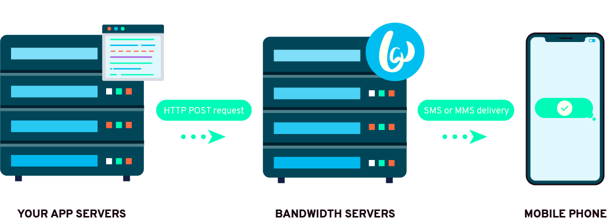

# Bandwidth Messaging API

The Messages resource lets you send both single SMS/MMS messages as well as Group SMS/MMS Messages.

Phone numbers used on this API are expected to be in E164 format (`+1XXXYYYZZZZ`)

#### Receive Incoming Messages
To receive [events/callbacks](../callbacks/messageEvents.md) for incoming and outgoing text messages (both SMS and MMS), you need to have a [Bandwidth Application](../../account/applications/about.md) configured to send callbacks to your server.

### Base URL

`https://messaging.bandwidth.com/api/v2`

### Capabilities

| Verb                           | Path                                                               | about                                                                         |
|:-------------------------------|:-------------------------------------------------------------------|:------------------------------------------------------------------------------|
| <code class="post">POST</code> | [`/users/{accountId}/messages`](../methods/messages/createMessage.md) | Send a text message to a single number or a group message to multiple numbers |

### Media & Attachment Management
| Verb                               | Path                                                                   | about                                                                          |
|:-----------------------------------|:-----------------------------------------------------------------------|:-------------------------------------------------------------------------------|
| <code class="get">GET</code>       | [`/users/{accountId}/media`](../methods/media/listMedia.md)               | Get a list of your media files                                                 |
| <code class="get">GET</code>       | [`/users/{accountId}/media/{mediaName}`](../methods/media/getMedia.md)    | Downloads an incoming MMS media attachment or an uploaded media file           |
| <code class="put">PUT</code>       | [`/users/{accountId}/media/{mediaName}`](../methods/media/uploadMedia.md) | Uploads a media file                                                           |
| <code class="delete">Delete</code> | [`/users/{accountId}/media/{mediaName}`](../methods/media/deleteMedia.md) | Permanently deletes an incoming MMS media attachment or an uploaded media file |
