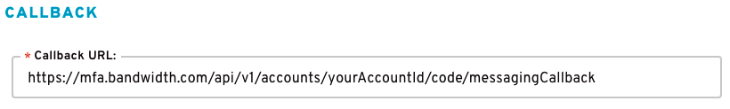

# Two-Factor Authentication Callbacks
Two-Factor Authentication Callbacks rely on DLRs (Delivery Receipts) sent to us by Bandwidth's Messaging platform. We then take these DLRs and send them to the specified URL that was set in the `callbackUrl` field in the [initial request](./methods/code/messaging.md).

Please read additional information regarding Bandwidth's Messaging Callbacks [here](../messaging/callbacks/messageEvents.md).

## Two-Factor Authentication Provisioning
When Two-Factor Authentication is enabled on your account, we generate a separate Application in Bandwidth's dashboard specifically for 2FA. As part of this application, there is a field present called `Callback URL` that we auto-populate with 2FA's callback URL. Doing this ensures proper logging of requests on our end so we can better service you in the event there is an issue, as well as simplifies the sending of different types of DLRs from messaging. We proxy all callbacks to the destination of your choice using the value in the `callbackUrl` field.

See the below image as an example of the Callback URL from the Bandwidth Dashboard. 
 

 
*Note: The path parameter `yourAccountId` is replaced with your overall Bandwidth Account ID.*

If you change the value in the Bandwidth Dashboard in the `Callback URL` field to something other than our 2FA Callback URL, you will be responsible for all handling of callbacks from Messaging.
