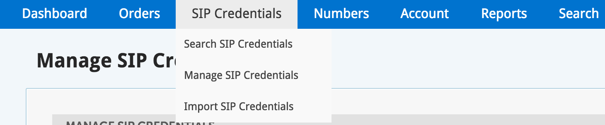
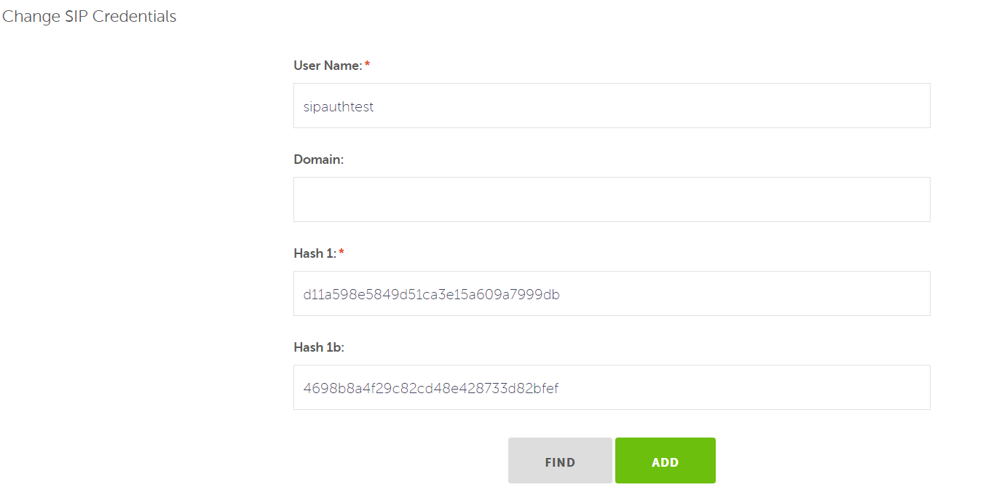

# Termination Network Bridge Provisioning
<br>
##Setting SIP Credentials

With these edge settings, a new menu item will appear on the Bandwidth Dashboard portal, ‘SIP Credentials’. This allows searching, managing, and importing SIP credentials via the Dashboard portal. 

###Bandwidth Dashboard SIP Credentials



###Important Information For You

* You must be able to create hash values via MD5. Bandwidth cannot advise customers on programs to use to create hash values, or create these hash values for customers.
* Bandwidth will provide the domain: custxx.auth.bandwidth.com

Here's an example of how to generate Hash1 and Hash1b values assuming that your username is "sipauthtest" and your password is "password". Take note that Bandwidth is not suggesting this method, but merely showing it as an example.

```
$ md5 -s sipauthtest:custxx.auth.bandwidth.com:password

MD5 ("sipauthtest:custxx.auth.bandwidth.com:password") = 857f1d8b4c6d16bc9300643b484872e2

$ md5 -s sipauthtest@custxx.auth.bandwidth.com:custxx.auth.bandwidth.com:password

MD5 ("foo@cust02.auth.bandwidth.com:cust02.auth.bandwidth.com:bar") = a1104d6106ef1fcab145181632023738
```

###SIP Credentials Menu Item



* SIP Credentials can also be managed via the Dashboard API (see [here](https://dev.bandwidth.com/docs/phone-numbers/) for a full description of the API). The resource, sipcredentials, is used for CRUD operations; create, update and delete

###Bandwidth uses the following format to pass calls (will require username and password):

```
sip:+15555551212@custxx.dev.sipauth.bandwidth.com:(insert port number)
```
