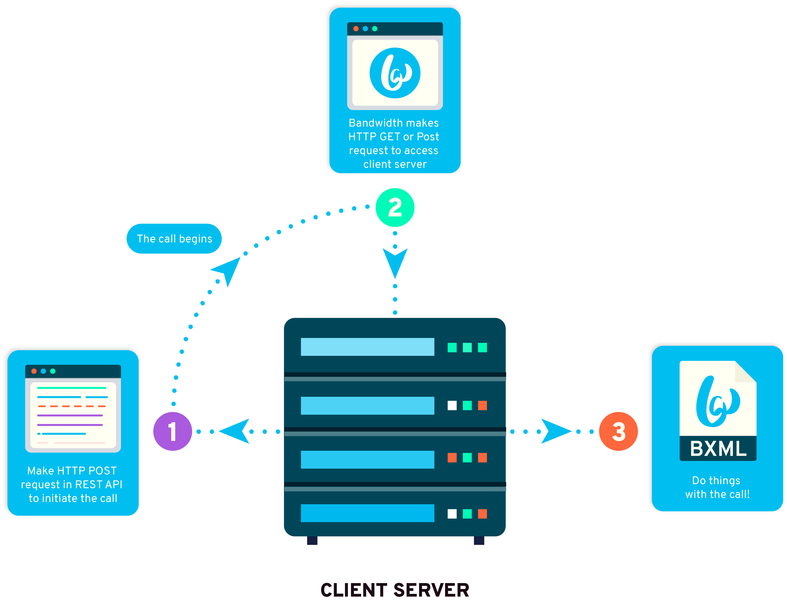

# Bandwidth XML (BXML)

Bandwidth XML allows you to create a voice application as easily as you create a Web application. Using Bandwidth XML (or BXML) your application handles incoming call events using standard action verbs that are described in XML.

Before we begin creating a new BXML application you’ll need two things initially setup:

1. A phone number that is allocated to your Bandwidth Application Platform account and is configured to an application. For instructions on setting up your application, read the [applications](../../account/applications/about.md) page

2. A public Web site that you can create content on and will handle the requests for BXML. Note that the endpoint for this site should be used to create the application in you setup above.

The maximum size of a BXML document is 64 KB.

###  Understanding BXML Callback Events
BXML callbacks are HTTP requests made by the Bandwidth platform to endpoints specified by you in your HTTP requests and BXML. Their purpose
is to 1) inform you of events that have happened in the call flow and 2) receive instructions from your
application on what to do next.

BXML callbacks are HTTP POST requests by default.  The request will have a JSON body that describes the event.  It
expects an XML response consisting of BXML verbs.

The first BXML callback is made when the call is created with [POST /calls](../methods/calls/postCalls.md) as
the `answerUrl` field.  Subsequent callbacks are made by specifying event-specific `*Url` attributes on the appropriate verbs.  If a
relative URL is provided in BXML, it is resolved relative to the request that retrieved that BXML.

If BXML execution ends without performing a callback, there is an implicit `<Hangup>` at the end of the document.

### Verbs

| Verb                                            | Description                                                                                           |
|:------------------------------------------------|:------------------------------------------------------------------------------------------------------|
| [`<Bridge>`](verbs/bridge.md)                   | The Bridge verb is used to bridge two calls.                                                          |
| [`<Conference>`](verbs/conference.md)           | The Conference verb is used to add a call to a conference.                                            |
| [`<Forward>`](verbs/forward.md)                 | The Forward verb is used to forward an unanswered incoming call to another number.                    |
| [`<Gather>`](verbs/gather.md)                   | The Gather verb is used to collect DTMF digits.                                                       |
| [`<Hangup>`](verbs/hangup.md)                   | The Hangup verb is used to hang up or reject a call.                                                  |
| [`<Pause>`](verbs/pause.md)                     | The Pause verb is used to delay verb execution for a period of time.                                  |
| [`<PauseRecording>`](verbs/pauseRecording.md)   | The PauseRecording verb is used to pause a recording previously started by a `<StartRecording>` verb. |
| [`<PlayAudio>`](verbs/playAudio.md)             | The PlayAudio verb is used to play an audio file in the call.                                         |
| [`<Record>`](verbs/record.md)                   | The Record verb allows a segment of audio to be recorded during a call.                               |
| [`<Redirect>`](verbs/redirect.md)               | The Redirect verb is used to redirect the current XML execution to another URL.                       |
| [`<ResumeRecording>`](verbs/resumeRecording.md) | The ResumeRecording verb is used to resume a recording previously paused by a `<PauseRecording>` verb.|
| [`<SendDtmf>`](verbs/sendDtmf.md)               | The SendDtmf verb is used to play DTMF digits in the call.                                            |
| [`<SpeakSentence>`](verbs/speakSentence.md)     | The SpeakSentence verb converts text into audible speech.                                             |
| [`<StartRecording>`](verbs/startRecording.md)   | The StartRecording verb allows a segment of a call to be recorded while other verbs are executing.    |
| [`<StopRecording>`](verbs/stopRecording.md)     | The StopRecording verb stops a recording that was previously started by a `<StartRecording>`.         |
| [`<Transfer>`](verbs/transfer.md)               | The Transfer verb is used to transfer the call to another number.                                     |

### BXML Callbacks

BXML callbacks are HTTP messages that are sent to your application server to notify you of activity related to your Bandwidth resources during a BXML usage.

| Callback                                                    | Description                                                                                                                                                                                |
|:------------------------------------------------------------|:-------------------------------------------------------------------------------------------------------------------------------------------------------------------------------------------|
| [Answer](callbacks/answer.md)                               | Bandwidth API sends this when the call is answered.                                                                                                                                        |
| [Bridge Complete](callbacks/bridgeComplete.md)              | Bandwidth API sends this to the application when a `<Bridge>` is complete and the original call needs to continue.                                                                         |
| [Bridge Target Complete](callbacks/bridgeTargetComplete.md) | Bandwidth API sends this to the application when a `<Bridge>` is complete and the target call needs to continue.                                                                           |
| [Gather](callbacks/gather.md)                               | Bandwidth API sends this when a `<Gather>` is completed.                                                                                                                                   |
| [Initiate](callbacks/initiate.md)                           | Bandwidth API sends this when an inbound call arrives.                                                                                                                                     |
| [Record Complete](callbacks/recordComplete.md)              | Bandwidth API sends this when a `<Record>` is completed. The recording is not available to download until the [Recording Available](callbacks/recordingAvailable.md) event is received.    |
| [Redirect](callbacks/redirect.md)                           | Bandwidth API sends this when a `<Redirect>` is requested or when a POST request is made to the [/calls/{callId}](../methods/calls/postCallsCallId.md) endpoint requesting a redirect.     |
| [Transfer Answer](callbacks/transferAnswer.md)              | Bandwidth API sends this when a `<Transfer>` is answered.                                                                                                                                  |
| [Transfer Complete](callbacks/transferComplete.md)          | Bandwidth API sends this when the `<Transfer>` is complete and the original call needs to continue.                                                                                        |
| [Conference Created](callbacks/conferenceCreated.md)        | Bandwidth API sends this when a new conference is created.                                                                                                                                 |
| [Conference Member Join](callbacks/conferenceMemberJoin.md) | Bandwidth API sends this when a new member joins a conference.                                                                                                                             |
| [Conference Member Exit](callbacks/conferenceMemberExit.md) | Bandwidth API sends this when a member leaves a conference.                                                                                                                                |

### Asynchronous Callbacks
| Callback                                                       | Description                                                                                                                      |
|:---------------------------------------------------------------|:---------------------------------------------------------------------------------------------------------------------------------|
| [Disconnect](callbacks/disconnect.md)                          | Bandwidth API sends this when a call ends.                                                                                       |
| [Conference Recording Available](callbacks/conferenceRecordingAvailable.md) | Bandwidth API sends this when a recording started by a `<StartRecording>`in a conference is available for download. |
| [Recording Available](callbacks/recordingAvailable.md)         | Bandwidth API sends this when a recording started by either a `<StartRecording>` or a `<Record>` verb on a call is available for download. |
| [Transfer Disconnect](callbacks/transferDisconnect.md)         | Bandwidth API sends this when any leg of a `<Transfer>` ends.                                                                    |
| [Transcription Available](callbacks/transcriptionAvailable.md) | Bandwidth API sends this when the transcription of a recording is available for download.                                        |
| [Conference Completed](callbacks/conferenceCompleted.md)       | Bandwidth API sends this after the last member leaves the conference.                                                            |
