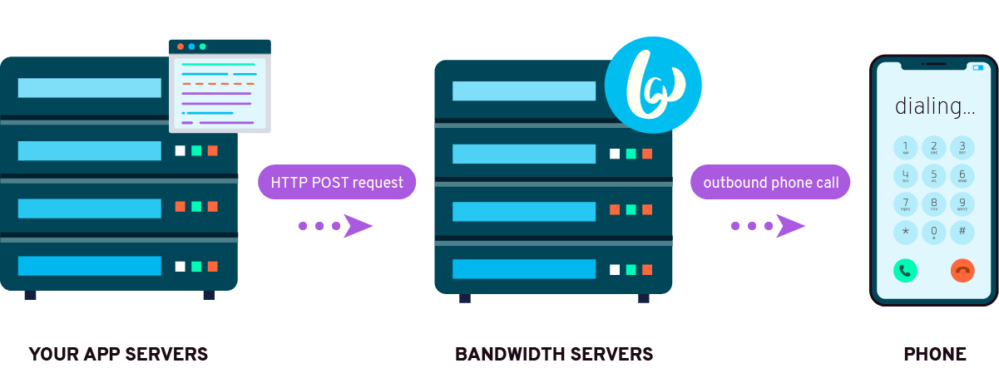

# Bandwidth Voice API

The Voice resource lets you orchestrate complex call flows and retrieve recording metadata

## Base URL
`https://voice.bandwidth.com/api/v2/accounts/{accountId}`

## Conventions
Some of the URLs in this documentation contain placeholders for values that your API client program must provide. These placeholders are shown in curly braces, like `{this}`. When you construct the URL to access these resources, replace those placeholders with the values you want to use.

## REST API Reference Index

| VERB                               | Resource                                                                                                                      | Description                                                                  |
|:-----------------------------------|:------------------------------------------------------------------------------------------------------------------------------|:-----------------------------------------------------------------------------|
| <code class="post">POST</code>     | [`/calls`](calls/postCalls.md)                                                                                                | Place phone calls                                                            |
| <code class="get">GET</code>       | [`/calls/{callId}`](calls/getCallsCallId.md)                                                                                  | Retrieve call information                                                    |
| <code class="post">POST</code>     | [`/calls/{callId}`](calls/postCallsCallId.md)                                                                                 | Replace an active call's BXML                                                |
| <code class="get">GET</code>       | [`/recordings`](recordings/getRecordings.md)                                                                                  | Returns a max of 1000 recordings, sorted by startTime from oldest to newest  |
| <code class="put">PUT</code>       | [`/calls/{callId}/recording`](recordings/putCallsCallIdRecording.md)                                                          | Pause or resume a recording on an active call                                |
| <code class="get">GET</code>       | [`/calls/{callId}/recordings`](recordings/getCallsCallIdRecordings.md)                                                        | Retrieve information about all of the recordings that occurred during a call |
| <code class="get">GET</code>       | [`/calls/{callId}/recordings/{recordingId}`](recordings/getCallsCallIdRecordingsRecordingId.md)                               | Retrieve information about a recording                                       |
| <code class="delete">DELETE</code> | [`/calls/{callId}/recordings/{recordingId}`](recordings/deleteCallsCallIdRecordingsRecordingId.md)                            | Delete the recording information, media and transcription                    |
| <code class="get">GET</code>       | [`/calls/{callId}/recordings/{recordingId}/media`](recordings/getCallsCallIdRecordingsRecordingIdMedia.md)                    | Download the recording media                                                 |
| <code class="delete">DELETE</code> | [`/calls/{callId}/recordings/{recordingId}/media`](recordings/deleteCallsCallIdRecordingsRecordingIdMedia.md)                 | Delete the recording media                                                   |
| <code class="post">POST</code>     | [`/calls/{callId}/recordings/{recordingId}/transcription`](recordings/postCallsCallIdRecordingsRecordingIdTranscription.md)   | Request a transcription                                                      |
| <code class="get">GET</code>       | [`/calls/{callId}/recordings/{recordingId}/transcription`](recordings/getCallsCallIdRecordingsRecordingIdTranscription.md)    | Retrieve the transcription                                                   |
| <code class="delete">DELETE</code> | [`/calls/{callId}/recordings/{recordingId}/transcription`](recordings/deleteCallsCallIdRecordingsRecordingIdTranscription.md) | Delete the transcription                                                     |
| <code class="get">GET</code>       | [`/conferences`](conferences/getConferences.md)                                                                               | Retrieve information about a max of 1000 conferences in the account          |
| <code class="get">GET</code>       | [`/conferences/{conferenceId}`](conferences/getConferencesConferenceId.md)                                                    | Retrieve conference information                                              |
| <code class="post">POST</code>     | [`/conferences/{conferenceId}`](conferences/postConferencesConferenceId.md)                                                   | Update an active conference                                                  |
| <code class="get">GET</code>       | [`/conferences/{conferenceId}/members/{memberId}`](conferences/getConferenceMember.md)                                        | Retrieve information about a conference member                               |
| <code class="put">PUT</code>       | [`/conferences/{conferenceId}/members/{memberId}`](conferences/putConferencesConferenceIdMembersMemberId.md)                  | Updates settings for a particular conference member                          |
